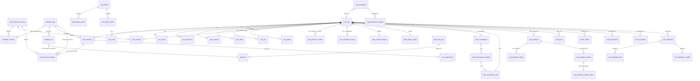

# 数据库 ER 图

> **提示**
> 本图仅展示核心业务表关系。完整表字段说明见 `docs/core/bs_exp_data-database-design.md`。

```mermaid
erDiagram
  %% ====== 基础字典 ======
  data_material_security ||--o{ material_security : defines
  data_material_security ||--o{ exp_security : defines
  data_material_security ||--o{ exp_material_security : defines

  %% ====== 材料体系 ======
  material_msg ||--o{ material_security : has_security_tags
  material_msg ||--o{ material_pic : has_pics
  material_msg ||--o{ exp_material : references

  material_msg ||--o{ exp_material_security : material_instance

  %% ====== 实验主表与子表 ======
  exp_msg ||--o{ exp_step : has
  exp_msg ||--o{ exp_material : has
  exp_msg ||--o{ exp_result : has
  exp_msg ||--o{ exp_reference : has
  exp_msg ||--o{ exp_scientist : has
  exp_msg ||--o{ exp_video : has
  exp_msg ||--o{ exp_pic : has
  exp_msg ||--o{ exp_grade : applies_to
  exp_msg ||--o{ exp_security : has_safety_tags
  exp_msg ||--o{ exp_reference_video : has_reference_videos
  exp_msg ||--o{ exp_simulation_record : has_simulations

  %% ====== 实验材料安全性 ======
  exp_material ||--o{ exp_material_security : has_security_tags
  exp_material ||--o{ exp_material_pic : has_pics

  %% ====== 标准实验库 ======
  exp_library ||--o{ exp_library_grade : includes
  exp_library ||--o{ exp_library_video : includes

  %% ====== 教材体系 ======
  exp_msg }o--|| data_school_subject : subject
  exp_msg }o--|| data_school_grade : grade
  exp_msg }o--|| data_coursebook : coursebook
  exp_msg }o--|| data_coursebook_unit : unit

  data_coursebook ||--o{ data_coursebook_chapter : has
  data_coursebook_chapter ||--o{ data_coursebook_unit : has

  %% ====== 题库系统 ======
  exp_msg ||--o{ exp_question : has_questions
  exp_question ||--o{ exp_question_select : has_options
  exp_question ||--o{ exp_question_answer : answered_by
  exp_question_answer ||--o{ exp_question_answer_select : selected_options

  %% ====== 文件系统 ======
  data_file_type ||--o{ data_file : typed_by
  material_pic }o--|| data_file : file_reference_optional

  %% ====== 社交互动 ======
  exp_msg ||--o{ social_like : liked_by
  exp_msg ||--o{ social_notlike : disliked_by
  exp_msg ||--o{ social_collection : collected_by
  exp_msg ||--o{ social_evaluate : evaluated_by

  %% ====== 作业分发 ======
  exp_homework }o--|| exp_msg : task_for
  exp_homework ||--o{ exp_homework_student : assigned_to

  %% ====== 审核 ======
  exp_msg ||--o{ exp_arbitration : arbitrated
  exp_arbitration ||--o{ exp_arbitration_like : supports
  exp_arbitration ||--o{ exp_arbitration_notlike : opposes
```
