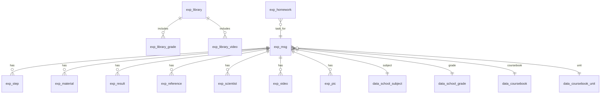

# 数据库 ER 图

```mermaid
erDiagram
  exp_library ||--o{ exp_library_grade : includes
  exp_library ||--o{ exp_library_video : includes
  exp_msg ||--o{ exp_step : has
  exp_msg ||--o{ exp_material : has
  exp_msg ||--o{ exp_result : has
  exp_msg ||--o{ exp_reference : has
  exp_msg ||--o{ exp_scientist : has
  exp_msg ||--o{ exp_video : has
  exp_msg ||--o{ exp_pic : has
  exp_msg }o--|| data_school_subject : subject
  exp_msg }o--|| data_school_grade : grade
  exp_msg }o--|| data_coursebook : coursebook
  exp_msg }o--|| data_coursebook_unit : unit
  exp_homework }o--|| exp_msg : task_for
```
