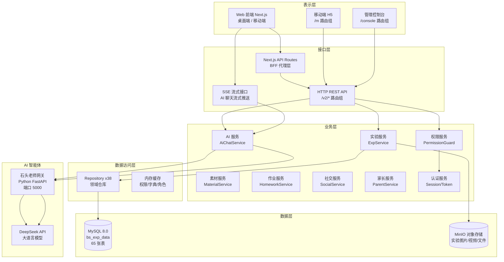
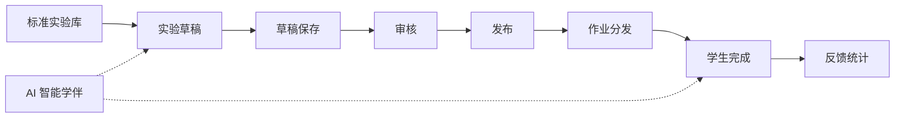
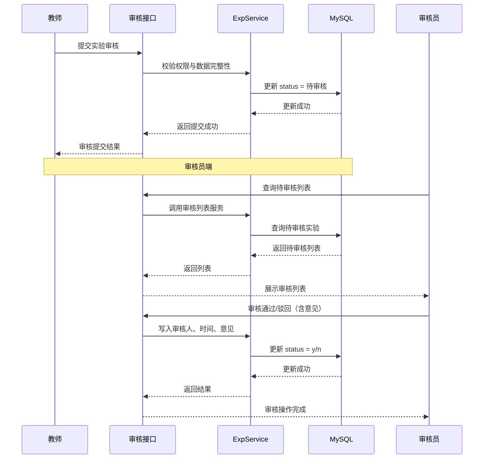
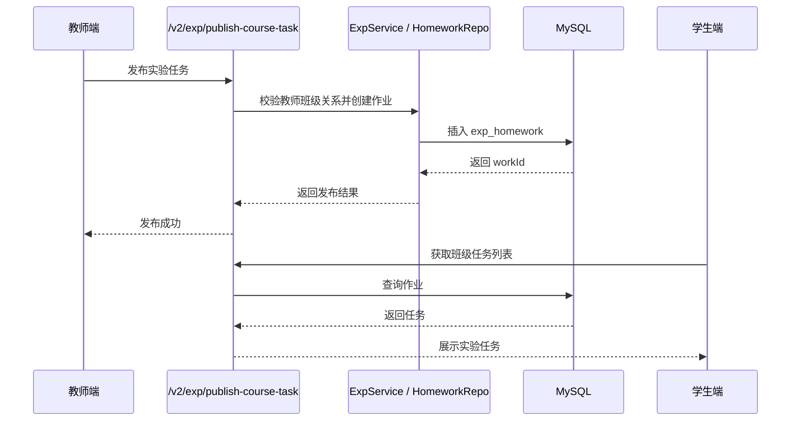
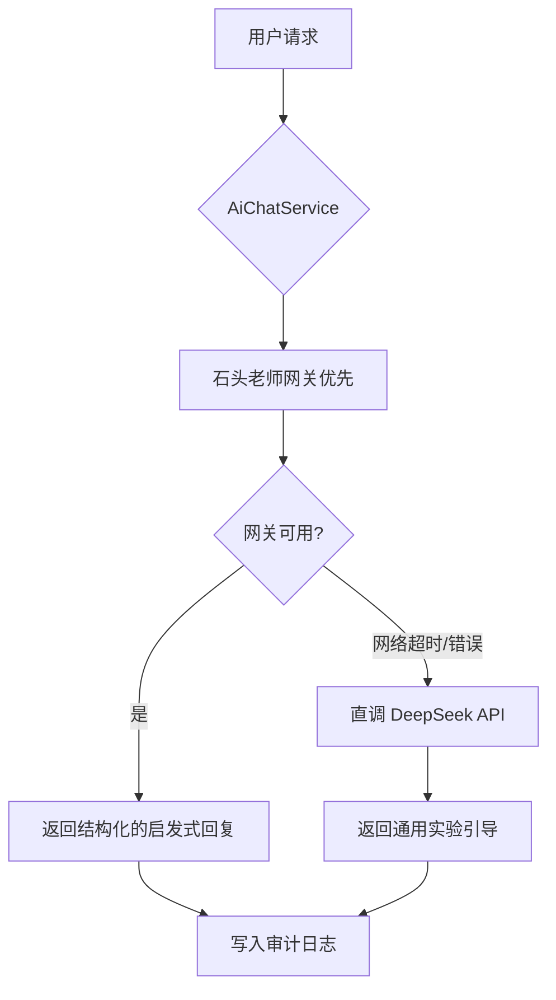
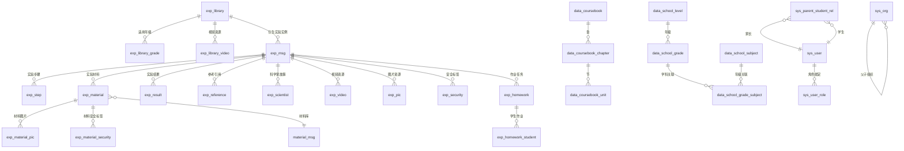

# 中小学科学实验教学管理平台 — 项目设计方案

- 版本：V1.0
- 编制日期：2026年5月
- 文档性质：技术方案设计说明书（投标用）

---

## 第一章 项目概述

### 1.1 项目背景

科学实验教学是中小学科学教育体系中的核心环节。当前实验教学面临资源分散、标准化程度低、教师备课负担重、学生实验过程缺乏引导与记录手段、家校协同断裂等痛点。为落实《关于加强和改进中小学实验教学的意见》等相关政策要求，提升区域实验教学质量和信息化管理水平，特建设本平台。

本平台旨在构建一个集实验资源管理、实验内容编辑、实验任务分发、学生实验操作、AI 智能学伴、家校协同、教学数据统计于一体的综合性实验教学管理平台。

### 1.2 建设目标

#### 1.2.1 功能性目标

- 建立标准化实验资源库，支持实验模板的沉淀与复用
- 支撑教师完成实验内容的创建、编辑、保存草稿、提交审核、发布使用全流程
- 支持实验内容结构化拆分（步骤、材料、结果、引用、科学家故事、视频、图片等）与聚合回填
- 支持实验与教材、章节、学科的灵活绑定
- 支持课程任务分发与班级关联
- 支持实验审核通过、驳回与重新编辑
- 支持学生实验任务接收、完成与提交
- 支持学生对实验的社交互动（点赞、收藏、评价）
- 支持家长查看学生实验学习情况与参与陪伴式学习
- 提供 AI 智能学伴"石头老师"，辅助学生完成科学实验设计

#### 1.2.2 非功能性目标

- 一致性：字段命名、接口体、数据库结构统一对齐
- 可维护性：主表加子表拆分清晰，便于扩展
- 可审计性：保留创建人、更新人、审核人、时间信息
- 可用性：草稿可重复保存，驳回后可重新提交
- 可扩展性：支持继续增加实验子表和任务流转能力
- 安全性：完善的角色权限体系与安全基线

### 1.3 系统定位

本平台定位为"实验资源生产与流转系统"，覆盖以下核心能力：

```
标准实验库沉淀 → 教师实验草稿编辑 → 实验审核与发布
  → 教材章节绑定 → 班级作业分发 → 学生实验完成
  → 社交行为互动 → 家校协同延展 → AI 智能辅助
```

系统面向五类用户角色：**学生**、**教师**、**教研员**、**学校管理员**、**区域管理员**（教育局），并为**家长**提供协同入口。

---

## 第二章 总体架构设计

### 2.1 系统分层架构



### 2.2 业务链路架构



### 2.3 技术栈全景

| 层级 | 技术选型 | 版本 |
|------|---------|------|
| 前端框架 | Next.js | 16.1.6 |
| 前端渲染 | React | 19.2.4 |
| 样式方案 | Tailwind CSS | v4 |
| UI 组件库 | Radix UI + shadcn/ui | - |
| 前端状态管理 | Zustand | v5 |
| 表单方案 | react-hook-form + Zod | - |
| 后端运行时 | Node.js + TypeScript (tsx) | Node 22 |
| 后端 Web 框架 | 原生 node:http（无第三方框架） | - |
| 数据库 | MySQL 8.0 | - |
| 对象存储 | MinIO（兼容 S3 API） | - |
| AI 网关 | Python FastAPI | - |
| AI 模型 | DeepSeek Chat API | - |
| 包管理器 | pnpm | 10.32.1 |
| CI/CD | GitHub Actions + PM2 | - |
| 部署 | 阿里云 ECS + PM2 集群 | - |

---

## 第三章 功能模块详细设计

### 3.1 实验资源管理中心

实验资源管理是平台核心，提供实验的统一浏览、筛选、检索入口。

#### 3.1.1 功能描述

- 浏览实验资源列表，支持分页展示
- 按学科（科学、物理、化学、生物等）筛选
- 按学段（小学低段 1-2 年级、中段 3-4 年级、高段 5-6 年级）筛选
- 按年级筛选
- 按教材版本、章节、小节筛选
- 按难度级别筛选
- 关键词模糊检索
- 查看实验详情，包括基础信息、教学上下文、材料清单、步骤说明、结果说明、参考引用、科学家故事、视频展示、安全提示等

#### 3.1.2 交互流程

```
用户进入实验列表页
  → 默认展示全部已发布的实验
  → 通过左侧筛选器选择学科/学段/年级
  → 列表实时过滤
  → 点击卡片进入实验详情
  → 详情页展示完整的结构化内容
```

### 3.2 实验编辑器（教师端）

实验编辑器是教师创建和管理实验内容的核心工具，提供富文本编辑、结构化数据维护、多媒体资源管理等功能。

#### 3.2.1 编辑器面板结构

编辑器采用三栏布局设计：

- **左侧大纲面板**：展示实验结构树形导航（基础信息、材料、步骤、结果、引用、科学家故事等），支持快速跳转
- **中间画布面板**：当前选中区块的详细编辑内容，包含富文本编辑器（基于 Tiptap）、表单字段、材料选择器等
- **右侧属性面板**：当前选中元素的可配置属性

#### 3.2.2 可编辑内容模块

| 模块 | 编辑内容 | 数据类型 |
|------|---------|---------|
| 基础信息 | 实验名称、学科、学段、年级、难度、课时、必做/选做 | 结构化字段 |
| 教学上下文 | 教材绑定、章节选择、教学关联 | 关联选择 |
| 实验原理 | 科学原理说明（支持富文本表格、图片） | 富文本 HTML |
| 实验材料 | 材料名称、用量、单位、属性、分类、主图、用途说明 | 结构化数组 |
| 实验步骤 | 步骤名称、步骤内容描述 | 结构化数组+富文本 |
| 实验结果 | 预期结果说明 | 结构化数组+富文本 |
| 安全提示 | 注意事项、危险提示 | 富文本 |
| 参考引用 | 引用名称、出处链接、说明 | 结构化数组 |
| 科学家故事 | 科学家姓名、故事名称、故事内容 | 结构化数组 |
| 多媒体资源 | 主视频、实验图片、封面图片 | 文件上传 |

#### 3.2.3 智能合并策略

当教师关联一个已审核通过的实验时，编辑器自动按以下策略合并数据：

1. **replace（覆盖）**：用户尚未编辑任何内容时，全量替换为关联实验的数据
2. **merge（追加+去重）**：用户已有自定义编辑内容时，对子表数组字段执行追加加去重，非数组非空字段保留原值
3. **mergeIfEmpty**：仅填充当前为空的字段

去重逻辑依据：
- 步骤：按步骤名称比较
- 材料：按材料库 ID 比较
- 结果：按结果名称比较
- 引用：按引用名称比较
- 科学家故事：按科学家姓名比较

#### 3.2.4 自动保存机制

- 内容变更后执行防抖提交，避免高频写库
- 页面处于编辑态时定期同步草稿状态
- 若用户连续输入，按最近一次变更重新计时
- 自动保存与手动保存共用同一数据构建逻辑

### 3.3 标准实验库

标准实验库是实验模板的沉淀中心，用于存放经过审核的标准化实验内容。

#### 3.3.1 功能描述

- 查看标准实验库资源列表
- 基于标准实验库快速生成实验草稿（教师可直接引用作为备课起点）
- 对标准实验进行二次编辑与复用
- 管理标准实验适用范围（适用年级）

#### 3.3.2 数据模型

标准实验库与实验实例采用双模型设计：

- `exp_library`：标准实验库主表，存放标准模板
- `exp_library_grade`：标准实验适用年级关联表
- `exp_library_video`：标准实验视频表
- `exp_msg`：实验实例表（教师或学生实际创建的实验内容），通过 `standard_exp_id` 外键指向标准库

### 3.4 审核与发布流程

实验内容在发布前需要经过审核环节，确保内容质量与合规性。

#### 3.4.1 审核流程



#### 3.4.2 状态流转

```
草稿（status = t）──提交审核──> 待审核
待审核 ──审核通过──> 已通过（status = y）
待审核 ──审核驳回──> 已驳回（status = n）
已驳回 ──修改后重提──> 待审核
```

#### 3.4.3 审核信息追溯

每条实验记录保留审核人 ID、审核时间、审核意见，支持全程追溯。

### 3.5 作业与任务分发

教师可以将审核通过的实验以作业形式分发给班级学生。

#### 3.5.1 功能描述

- 将实验分发给指定班级
- 支持按教材批量分发相关实验（如一次性分发整个章节的相关实验）
- 设置任务截止时间与要求
- 查看任务发布与执行情况
- 学生端接收任务、查看要求

#### 3.5.2 数据模型

- `exp_homework`：教师发布作业表，记录发布人、班级、截止日期
- `exp_homework_student`：学生实验作业表，包含作业快照机制（教师版快照冻结、学生副本独立）

#### 3.5.3 分发流程



### 3.6 学生实验工作台

学生工作台是学生完成实验任务和学习记录的统一入口。

#### 3.6.1 功能描述

- 查看班级发布的实验任务列表
- 按照任务要求完成实验
- 查看个人实验完成进度状态
- 记录个人实验学习足迹
- 提交实验成果（图片、视频等）
- 自主探索实验广场中的公开实验

#### 3.6.2 数据支撑

- `exp_homework_student`：学生作业完成记录
- `exp_simulation_record`：模拟实验记录
- `v2-student-footprints`：学生实验足迹

### 3.7 社交互动系统

为实验内容增加社交属性，提升学生参与度和实验内容的反馈质量。

#### 3.7.1 功能描述

- 对实验点赞和倒赞
- 收藏实验
- 对实验进行评价
- 实验小法庭（实验仲裁）：对实验内容发起仲裁、支持或反对
- 查看实验互动统计数据（点赞数、收藏数、评价数）

#### 3.7.2 数据模型

- `social_like` / `social_notlike`：点赞/倒赞记录
- `social_collection`：收藏记录
- `social_evaluate`：评价记录
- `exp_arbitration` / `exp_arbitration_like` / `exp_arbitration_notlike`：仲裁系统

实验主表 `exp_msg` 中的 `like_num`、`notlike_num`、`collection_num`、`evaluate_num` 为聚合统计字段，通过社交表行为触发器维护。

### 3.8 家校协同系统

为家长提供参与学生实验学习的渠道，构建家校共育闭环。

#### 3.8.1 功能描述

- 家长通过绑定学生建立关联关系
- 查看学生的实验学习情况与完成进度
- 家长陪伴式学习（家长-学生陪伴会话）
- 查看家校协同报告
- 管理家长与学生的绑定关系
- 完成家长端学习任务

#### 3.8.2 数据模型

- `sys_parent_student_rel`：家长-学生关系表
- `parent_session`：家长陪伴会话记录
- `parent_report`：家校协同报告

### 3.9 AI 智能学伴（石头老师）

AI 智能学伴"石头老师"是平台的特色功能，为学生提供科学实验设计的启发式引导。

#### 3.9.1 系统架构

```mermaid
flowchart LR
  subgraph 前端
    PAGE[AI 助手页面]
    PANEL[侧滑面板]
  end

  subgraph 后端 Node.js
    ROUTE[/v2/ai 路由]
    SVC[AiChatService]
  end

  subgraph AI 网关 Python
    MAIN[FastAPI 入口]
    SAFETY[安全过滤器]
    PROMPT[Prompt 引擎]
    SM[状态机]
    LLM_SVC[LLM 调用]
  end

  subgraph 外部
    API[DeepSeek API]
  end

  PAGE --> ROUTE --> SVC --> MAIN --> SAFETY --> PROMPT --> LLM_SVC --> API
  SM --> PROMPT
  SVC -->|降级| API
```

#### 3.9.2 7 阶段状态机推演

石头老师通过线性状态机引导学生一步步完成实验设计：

```
INIT → GOAL → MATERIAL → STEP → RECORD → CONCLUSION → FINAL
```

| 阶段 | 聚焦任务 | 推进条件 |
|------|---------|---------|
| INIT | 破冰，收集年级和实验想法 | 消息 >= 4 字，命中关键词语 |
| GOAL | 锚定实验目的与假设 | 消息 >= 8 字，命中"假设/猜想/目的是"等 |
| MATERIAL | 梳理实验所需材料 | 消息 >= 6 字，命中"材料/工具/瓶子"等 |
| STEP | 设计实验操作步骤 | 消息 >= 10 字，命中"先/然后/再/步骤"等 |
| RECORD | 引导实验记录与数据收集 | 消息 >= 6 字，命中"表格/记录/数据"等 |
| CONCLUSION | 预设结论逻辑 | 消息 >= 8 字，命中"结论/发现/说明"等 |
| FINAL | 综合打磨终稿 | 终点 |

状态机基于关键词加消息长度规则推进，不依赖 LLM 判断，保证可预测性和稳定性。

#### 3.9.3 年级专属策略

| 等级 | 覆盖年级 | 特点 |
|------|---------|------|
| 低段 | 1-2 年级 | 童趣化短句（不超过 50 字），4 模块框架，全程大人陪同 |
| 中段 | 3-4 年级 | 半结构化（不超过 100 字），5 模块框架，引入"变量""记录表" |
| 高段 | 5-6 年级 | 严谨变量控制（不超过 150 字），9 点完整框架，强调对照实验 |

#### 3.9.4 安全过滤机制

采用前置安全过滤器，在请求发给 LLM 之前拦截潜在风险内容：

- 危险关键词库覆盖 6 类 22 个关键词：火类、化学类、利器类、电类、毒品类、爆炸物
- 命中时返回友好提示信息，引导询问替代实验方案
- 拦截记录写入数据库，标记 `safety_blocked: true`

#### 3.9.5 双通道降级策略



- 网关配置超时 120 秒，直调降级超时 30 秒
- 仅网络错误/超时触发降级，4xx 或空响应直接向上抛错
- 至多重试 1 次，保证响应时效

#### 3.9.6 数据持久化

| 数据表 | 存储内容 |
|--------|---------|
| `ai_chat_session` | 会话信息（用户、年级、当前阶段、实验标题） |
| `ai_chat_message` | 消息明细（角色、内容、元数据含 traceId、token 用量） |
| `ai_task_log` | 任务审计日志（耗时、token 数、是否采纳） |
| `ai_task_draft` | AI 生成草稿缓存 |

### 3.10 平台管理系统

#### 3.10.1 用户管理

- 用户创建、编辑、启停用
- 用户角色绑定
- 用户组织归属管理

#### 3.10.2 组织管理

- 多层级组织架构：教育局/管理 → 学校 → 校区 → 学段 → 年级 → 班级
- 组织树形浏览与维护
- 组织类型管理

#### 3.10.3 角色与权限管理

- 7 个宪法角色：系统管理员、区域管理员、学校管理员、教研员、教师、学生、家长
- 学科影子角色（自动同步）
- 页面级读写权限管控（34 个可控页面）
- 操作级权限管控（实验创建、编辑、删除、发布、审核等）

#### 3.10.4 字典管理

- 学科、学段、年级、难度、题型、材料属性等基础字典的维护
- 字典变更审计日志
- 业务字典与系统字典分离管理

#### 3.10.5 系统日志

- 操作日志记录与查询
- 支持按时间、用户、操作类型筛选

#### 3.10.6 反馈管理

- 用户意见反馈提交与处理
- 反馈状态跟踪

---

## 第四章 技术架构设计

### 4.1 前端架构

#### 4.1.1 框架选型

前端采用 Next.js 16 (App Router) + React 19，构建在 TypeScript 严格模式之上。

| 技术 | 用途 | 版本 |
|------|------|------|
| Next.js | 全栈框架（SSR/SSG/ISR） | 16.1.6 |
| React | UI 渲染 | 19.2.4 |
| TypeScript | 类型安全 | 5.7.3 |
| Tailwind CSS v4 | 样式方案 | 4.2.0 |
| Radix UI | 无样式可访问组件基座 | - |
| shadcn/ui | 组件集合 | - |
| Zustand | 轻量状态管理 | v5 |
| react-hook-form | 表单管理 | - |
| Zod | 运行时数据校验 | 4.3.6 |
| @tanstack/react-table | 数据表格 | 8.21.3 |
| Tiptap | 富文本编辑器 | 3.22.4 |
| recharts | 图表展示 | 2.15.0 |
| react-markdown | Markdown 渲染 | 10.1.0 |
| framer-motion | 动画过渡 | 11.18.2 |

#### 4.1.2 路由设计

使用 Next.js App Router 组织页面结构：

- `(dashboard)/`：桌面端认证后页面组
  - `teacher/`：教师工作台（实验编辑器、作业管理）
  - `student/`：学生工作台
  - `parent/`：家长工作台
  - `console/`：管理控制台
  - `experiments/`：实验探索
  - `ai-assistant/`：AI 对话页面
  - `settings/`：用户设置
- `m/`：移动端独立页面组
- `login/`、`register/`：认证页面
- `api/`：BFF 层 API Routes

#### 4.1.3 双视图模式

平台支持两种视图模式：

- **门户模式（portal）**：统一学习入口，学生和家长默认视图
- **管理模式（management）**：按角色的工作台，教师、教研员、管理员默认视图

视图模式持久化在 localStorage，支持用户手动切换。

#### 4.1.4 响应式壳层

桌面端采用可折叠侧栏加顶栏布局（lg 断点以上），移动端采用顶栏加 Sheet 抽屉（lg 断点以下），侧栏折叠状态通过 localStorage 持久化。

#### 4.1.5 组件设计思想

前端组件采用原子设计方法论：

- `atoms/`：基础 UI 原子组件（按钮、输入框、标签）
- `business/`：业务组件（实验卡片、视频播放器、媒体选择器）
- `layout/`：布局组件（应用壳层、侧栏导航、内容区域）
- `common/`：通用组件（错误边界、加载态）
- `v2/`：V2 版本通用组件（分页、状态徽标、学科筛选）

#### 4.1.6 移动端

移动端（`/m/*`）拥有独立的路由组、布局和导航体系，包括固定底部导航栏（3 项：视频广场、魔法球 AI 助手、个人中心），并采用学段感知的渐变背景色。

### 4.2 后端架构

#### 4.2.1 框架选型

后端采用**纯原生 Node.js HTTP 服务**，不使用 Express/Koa/Fastify 等第三方框架，以最大限度减少依赖、提升可控性和性能。

| 技术 | 用途 | 版本 |
|------|------|------|
| Node.js | 运行时 | 22 LTS |
| TypeScript | 开发语言 | 5.7.3 |
| mysql2 | MySQL 驱动 | 3.22.1 |
| AWS SDK S3 | MinIO 对象存储 SDK | 3.1030.0 |
| zod | 数据校验 | 3.24.1 |
| bcryptjs | 密码哈希 | 3.0.3 |
| pinyin-pro | 中文转拼音（ID 生成） | 3.26.0 |
| sharp | 图片处理 | 0.33.5 |

#### 4.2.2 分层架构

- **路由层（Routes）**：35 个路由文件，每个路由函数签名 `(request) => Response`，扁平数组注册
- **服务层（Services）**：16 个服务文件，封装业务逻辑
- **仓库层（Repositories）**：38 个仓库文件，封装数据访问
- **领域类型层（Domain Types）**：约 20 个类型定义文件

#### 4.2.3 原生 HTTP 中间件机制

服务器在内联方式实现以下中间件功能：

1. **CORS**：白名单模式的跨域头处理，OPTIONS 预检请求直接返回 204
2. **traceId**：每个请求生成 UUID，通过 `x-trace-id` 响应头透传全链路
3. **Session 注入**：从 Cookie 读取 `v2_access_token`，解析注入 `x-user-id`/`x-org-id`/`x-role`/`x-school-level-id` 请求头
4. **SSE 流式路由**：AI 聊天流式接口直接操作原生 req/res
5. **文件流式代理**：文件下载通过 Web ReadableStream 管道传输
6. **自动预签名**：JSON 响应中 MinIO 内网 URL 自动替换为公网预签名 URL

#### 4.2.4 API 风格

- 统一前缀：`/v2/*`
- 请求体：JSON format
- 响应结构：`{ success: boolean, data: any, message: string | null, error: { code, message } | null }`
- 认证方式：Cookie-based HTTP Only Token
- 日期传输：字符串格式 `YYYY-MM-DD HH:mm:ss`

### 4.3 AI 架构

#### 4.3.1 整体架构

AI 子系统采用三段式增强架构：

1. **AI Orchestrator 编排层**：意图识别、RAG 检索、模型路由、结构化输出
2. **Structured Write-back 回写层**：字段校验、分表映射、差异对比、草稿持久化
3. **Human Review 人工确认层**：应用到编辑器、确认发布、驳回修改

#### 4.3.2 石头老师智能体网关

AI 智能体网关是一个独立的 Python FastAPI 微服务，作为"石头老师"角色化的 LLM 代理：

| 组件 | 技术 | 用途 |
|------|------|------|
| Web 框架 | FastAPI | API 服务 |
| 数据库 ORM | SQLAlchemy Async + aiomysql | 异步 MySQL 操作 |
| LLM SDK | OpenAI Python SDK | DeepSeek API 调用 |
| 配置管理 | Pydantic Settings | 环境变量管理 |

#### 4.3.3 端点清单

| 方法 | 路径 | 说明 |
|------|------|------|
| POST | /v1/chat | 非流式聊天（主协议） |
| POST | /v1/chat/stream | SSE 流式聊天（主协议） |
| POST | /run | 旧兼容非流式 |
| POST | /stream_run | 旧兼容流式 |
| POST | /api/v1/session/create | 创建会话 |
| GET | /api/v1/session/{id} | 查询会话 |
| GET | /health | 健康检查 |

#### 4.3.4 错误处理与重试

| 错误类型 | 是否可重试 | HTTP 表现 |
|---------|-----------|----------|
| 密钥未配置 | 否 | 503 |
| 超时 | 是 | 503 |
| HTTP 5xx/429 | 是 | 503 |
| HTTP 4xx | 否 | 400 |
| 空响应 | 否 | 503 |
| 网络错误 | 是 | 503 |

### 4.4 基础设施

#### 4.4.1 CI/CD 流水线

```yaml
CI 流水线（GitHub Actions）：
  TypeScript 类型检查:
    - 后端 tsc --noEmit
    - 前端 tsc --noEmit
  前端构建:
    - pnpm build（Next.js 生产构建）

CD 流水线（GitHub Actions + SSH）：
  推送 main 分支触发:
    - 通过 SSH 连接生产服务器
    - 执行部署脚本（git pull + pnpm install + pnpm build + pm2 restart）
```

#### 4.4.2 生产环境部署

```
PM2 进程管理（3 个进程）:
  - bs-lab-backend  端口 4100  Node.js HTTP 服务
  - bs-lab-frontend 端口 4200  Next.js 生产服务
  - bs-lab-webhook            部署 Webhook

内存限制：每进程 500MB 自动重启
监控：PM2 日志 + PM2 状态监控
```

#### 4.4.3 对象存储

采用 MinIO 作为对象存储（兼容 AWS S3 API），存储实验图片、视频、封面等多媒体资源，通过预签名 URL 实现安全访问。

**预签名 URL 策略**：
- 默认有效期：900 秒（15 分钟）
- 自动识别内网/公网地址
- 响应 Body 中文件 URL 自动预签名处理
- 检测到内网地址（localhost/10.x/172.16-31.x/192.168.x）时自动使用公网端点

---

## 第五章 数据库设计

### 5.1 数据库概览

数据库名称：`bs_exp_data`，共计 **65 张表**，以 `varchar(32)` 作为业务主键风格。

### 5.2 数据分类

#### 5.2.1 基础字典数据（21 张表）

| 表名 | 用途 |
|------|------|
| `data_coursebook` | 教材主数据 |
| `data_coursebook_chapter` | 教材章 |
| `data_coursebook_unit` | 教材节 |
| `data_school_subject` | 学科 |
| `data_school_level` | 学段 |
| `data_school_grade` | 年级 |
| `data_school_grade_subject` | 年级-学科关联 |
| `data_difficulty_type` | 题库难度类型 |
| `data_exp_difficulty` | 实验难度 |
| `data_question_type` | 题型 |
| `data_question_capacity` | 能力侧重点 |
| `data_rating_scale` | 评分等级 |
| `data_pref_title` | 职称 |
| `data_role` | 角色 |
| `data_msg_type` | 消息类型 |
| `data_org_type` | 组织类型 |
| `data_material_type` | 材料分类 |
| `data_material_prop` | 材料属性 |
| `data_material_unit` | 材料计量单位 |
| `data_file_type` | 文件素材类别 |
| `data_file` | 文件资源主表 |
| `data_material_security` | 材料安全字典 |

#### 5.2.2 实验业务数据（25 张表）

| 表名 | 用途 |
|------|------|
| `exp_library` | 标准实验库主表 |
| `exp_library_grade` | 标准实验适用年级 |
| `exp_library_video` | 标准实验视频 |
| `exp_msg` | 实验主表（核心实体） |
| `exp_grade` | 实验适用年级 |
| `exp_video` | 实验视频 |
| `exp_pic` | 实验图片 |
| `exp_material` | 实验材料明细 |
| `exp_material_pic` | 实验材料图片 |
| `exp_material_security` | 实验材料安全标签 |
| `exp_step` | 实验步骤 |
| `exp_result` | 实验结果 |
| `exp_security` | 实验安全标签 |
| `exp_reference` | 实验参考引用 |
| `exp_reference_video` | 实验引用视频 |
| `exp_scientist` | 实验科学家故事 |
| `exp_simulation_record` | 模拟实验记录 |
| `exp_homework` | 教师发布作业 |
| `exp_homework_student` | 学生作业记录 |
| `exp_arbitration` | 实验仲裁 |
| `exp_arbitration_like` | 仲裁支持 |
| `exp_arbitration_notlike` | 仲裁反对 |
| `exp_question` | 实验题目 |
| `exp_question_answer` | 题目答案 |
| `exp_question_select` | 题目标答 |

#### 5.2.3 素材数据（3 张表）

| 表名 | 用途 |
|------|------|
| `material_msg` | 材料主库 |
| `material_pic` | 材料图片 |
| `material_security` | 材料安全标签 |

#### 5.2.4 社交与评价数据（5 张表）

| 表名 | 用途 |
|------|------|
| `social_collection` | 收藏 |
| `social_evaluate` | 评价 |
| `social_like` | 点赞 |
| `social_notlike` | 倒赞 |
| `scale_log` | 量表评分日志 |

#### 5.2.5 家长协同数据（2 张表）

| 表名 | 用途 |
|------|------|
| `parent_session` | 家长陪伴会话 |
| `parent_report` | 家校协同报告 |

#### 5.2.6 分组数据（2 张表）

| 表名 | 用途 |
|------|------|
| `subject_group` | 学科分组 |
| `subject_group_member` | 分组组成员 |

#### 5.2.7 AI 数据（4 张表）

| 表名 | 用途 |
|------|------|
| `ai_chat_session` | AI 聊天会话 |
| `ai_chat_message` | AI 聊天消息 |
| `ai_task_log` | AI 任务审计日志 |
| `ai_task_draft` | AI 草稿缓存 |

#### 5.2.8 系统数据（8 张表）

| 表名 | 用途 |
|------|------|
| `sys_user` | 用户 |
| `sys_user_role` | 用户角色关联 |
| `sys_org` | 组织 |
| `sys_menu` | 菜单 |
| `sys_role_menu_perm` | 角色菜单权限 |
| `sys_msg` | 系统消息 |
| `sys_log` | 系统日志 |
| `sys_feedback` | 意见反馈 |
| `sys_auth_refresh_token` | 刷新令牌持久化 |
| `sys_parent_student_rel` | 家长学生关系 |
| `teacher_class` | 教师班级关系 |

### 5.3 核心实体关系



### 5.4 设计原则

- **主键策略**：业务主键 `varchar(32)`，系统辅助表使用 `int auto_increment`
- **字段命名**：主键统一 `_id`，名称统一 `_name`，说明统一 `comments`，排序统一 `sort_order`
- **审计字段**：`create_time`、`update_time`、`create_user_id`、`update_user_id`
- **软删除**：核心表带 `is_deleted` 字段，保留历史数据与引用完整性
- **索引策略**：外键字段建索引，高频查询字段建组合索引，唯一约束保证业务唯一性
- **外键约束**：保持引用完整性，防止非法删除导致悬挂数据

---

## 第六章 安全体系设计

### 6.1 认证机制

采用**自建 HMAC 签名双 Token 机制**（替代第三方 JWT 库）：

| Token 类型 | 有效期 | 用途 | 存储 |
|-----------|--------|------|------|
| `v2_access_token` | 15 分钟 | 请求认证 | Cookie（HttpOnly + Secure + SameSite=Lax） |
| `v2_refresh_token` | 30 天 | 轮换续期 | Cookie + MySQL 持久化 |

- Token 结构：`base64UrlEncode(payload) + "." + HMAC-SHA256(payload)`
- 密钥长度：生产环境强制 >= 32 字符
- 刷新 Token 采用轮换机制（rotation counter 递增），防止重放攻击
- 支持多实例部署：内存 Map 快速验证 + MySQL 持久化备份
- 登出时主动撤销 Token

### 6.2 权限体系

采用**角色-权限（RBAC）模型**，7 个宪法角色：

| 角色 | 标识 | 权限等级 |
|------|------|---------|
| 系统管理员 | Role_Sys_Admin | 全部权限，无限制 |
| 区域管理员 | Role_District_Admin | 教研员权限 + 发布实验 |
| 学校管理员 | Role_School_Admin | 实验管理 + 用户/角色/组织管理 |
| 教研员 | Role_Researcher | 教师权限 + 删除/发布实验、审核 |
| 教师 | Role_Teacher | 实验创建/编辑、批改、出题 |
| 学生 | Role_Student | 实验查看 |
| 家长 | Role_Parent | 实验查看 |

#### 6.2.1 权限粒度

- **页面级权限**：34 个可控页面，每个页面有 READ/WRITE 两种操作
- **操作级权限**：实验查看、创建、编辑、删除、发布、审核等细粒度操作
- **学科影子角色**：`Subj_` 前缀角色，由触发器自动同步，支持学科粒度的权限控制

#### 6.2.2 权限守卫

- 后端：`permission-guard.ts` 提供 `assertPermission`、`assertPageRead`、`assertPageWrite` 等守卫函数
- 前端：`with-permission.tsx` 提供页面级权限守卫 HOC 和 hooks

### 6.3 数据安全

- **密码存储**：bcryptjs 哈希处理，不存储明文
- **文件访问**：MinIO 预签名 URL，有效期可控，避免永久链接泄露
- **内网地址检测**：自动检测并替换内网存储地址为公网预签名地址
- **Cookie 安全**：生产环境 HttpOnly + Secure + SameSite=Lax

### 6.4 安全基线

- CORS 白名单模式，仅允许配置的源访问
- 生产环境强制配置 MinIO 公网域名
- SQL 注入防护：表名/列名消毒（仅允许 `[a-zA-Z0-9_]` 字符）
- 数据校验：所有外部数据进入系统时先通过 Zod 校验

---

## 第七章 部署与运维方案

### 7.1 生产环境部署拓扑

```
阿里云 ECS 单机部署（轻量级方案）:
┌─────────────────────────────────────┐
│  PM2 进程管理器                       │
│  ├─ bs-lab-backend  (:4100)         │
│  │   ├─ Node.js HTTP API 服务        │
│  │   └─ 内存限制 500MB               │
│  ├─ bs-lab-frontend (:4200)         │
│  │   ├─ Next.js 生产服务             │
│  │   └─ 内存限制 500MB               │
│  └─ bs-lab-webhook                  │
│      └─ 部署自动触发                 │
├─────────────────────────────────────┤
│  外部依赖：                           │
│  ├─ MySQL 8.0（可独立部署）           │
│  └─ MinIO 对象存储（可独立部署）       │
└─────────────────────────────────────┘
```

### 7.2 自动部署流程


### 7.3 环境变量管理

- 开发环境：`.env.local` 本地文件（不提交 Git）
- 生产环境：`.env.local` 服务器文件
- 密钥规范：生产环境密钥强制满足长度与复杂度要求
- 关键配置项包括：数据库连接、MinIO 端点与密钥、Session 密钥、AI API Key、CORS 域名白名单

### 7.4 健康检查与监控

- `GET /health` 端点用于健康检查
- PM2 进程崩溃自动重启（max_memory_restart: 500MB）
- PM2 日志管理（`pm2 logs --lines 30` 查看最近的日志）

### 7.5 数据一致性维护

- 提供专用运维接口：`/v2/ops-consistency` 数据一致性检查
- 提供 `/v2/ops-cache` 缓存操作管理
- 提供 `/v2/ops-data-export` 数据导出能力
- 提供 `/v2/ops-dict-sync` 字典同步能力

---

## 第八章 非功能性设计

### 8.1 容错与降级

| 场景 | 降级策略 |
|------|---------|
| AI 网关不可用 | 自动直调 DeepSeek API（降级） |
| AI 流式中断 | 自动重试 1 次（仅网络错误） |
| 数据库连接失败 | 返回 503 与重试提示 |
| 文件存储不可用 | 显示占位图/提示信息 |
| 移动端 API 失败 | 降级展示静态数据 |

### 8.2 超时策略

| 依赖 | 连接超时 | 请求超时 |
|------|---------|---------|
| MySQL | 默认 | 默认 |
| MinIO S3 | 10 秒 | 60 秒 |
| AI 网关 | - | 120 秒 |
| AI 直调 | - | 30-60 秒 |

### 8.3 重试与幂等

- 仅对可重试错误执行重试，最多 3 次
- 写操作通过 `idempotencyKey` 保证幂等
- 指数退避加随机抖动避免重试风暴

### 8.4 可观测性

- **traceId**：每个请求生成，通过 `x-trace-id` 响应头透传全链路
- **审计日志**：AI 任务调用记录 `ai_task_log`，包含耗时、token 数、模型、状态
- **业务日志**：`sys_log` 表记录关键操作
- **阶段日志**：复杂流程（上传、缩略图生成等）打阶段日志

### 8.5 可扩展性设计

- 实验子表可继续扩展（新增内容模块只需增加子表和对应保存逻辑）
- 审核流可增加多级审核节点
- 统计维度可增加更细粒度的聚合分析
- AI 提示模板可通过管理后台动态配置
- API 接口采用统一的前缀 `/v2/*`，支持版本演进

---

## 第九章 项目交付物清单

### 9.1 可执行交付物

| 序号 | 交付物 | 说明 |
|------|--------|------|
| 1 | 前端 Web 应用源码 | Next.js 前端完整源码包 |
| 2 | 后端 API 服务源码 | Node.js 后端完整源码包 |
| 3 | AI 智能体网关源码 | Python FastAPI 智能体源码包 |
| 4 | 共享 UI 库源码 | @bs-lab/ui 组件库源码包 |
| 5 | 数据库迁移脚本 | 完整的数据库 DDL 与增量迁移脚本 |
| 6 | 数据库种子数据 | 基础字典数据初始化脚本 |
| 7 | GitHub Actions CI/CD 配置 | 构建验证与自动部署工作流 |
| 8 | PM2 生产部署配置 | 进程管理与启动脚本 |

### 9.2 文档交付物

| 序号 | 交付物 | 说明 |
|------|--------|------|
| 1 | 项目设计方案（本文档） | 技术方案设计说明书 |
| 2 | 数据库设计文档 | 65 张表的详细结构设计 |
| 3 | 实验业务详细设计文档 | 接口、服务、前端、业务流程说明 |
| 4 | OpenAPI 接口契约 | YAML 格式接口定义 |
| 5 | 术语表 | 业务术语统一说明 |
| 6 | 错误码参考 | 全量错误码与处理说明 |
| 7 | 数据库 ER 图 | 核心实体关系图示 |
| 8 | 运维部署手册 | 环境搭建与运维操作说明 |
| 9 | 环境变量配置模板 | 开发与生产环境配置说明 |

### 9.3 技术指标

| 指标项 | 数值 |
|--------|------|
| 数据库表总数 | 65 张 |
| 后端 API 接口数 | 约 100 个 |
| 前端页面数 | 约 50 个路由组 |
| 后端服务数 | 16 个服务模块 |
| 后端仓库数 | 38 个数据访问模块 |
| 前端 API 封装数 | 35 个 API 模块 |
| 前端自定义 Hooks | 18 个 |
| 前端组件数 | 近百个业务/布局/通用组件 |
| 用户角色类型 | 7 个宪法角色 + 学科影子角色 |
| AI 状态机阶段 | 7 阶段线性推演 |
| 支持的年级范围 | 小学 1-6 年级（三学段策略） |
| 部署方式 | PM2 进程管理 + GitHub Actions CI/CD |

---

*文档结束*
