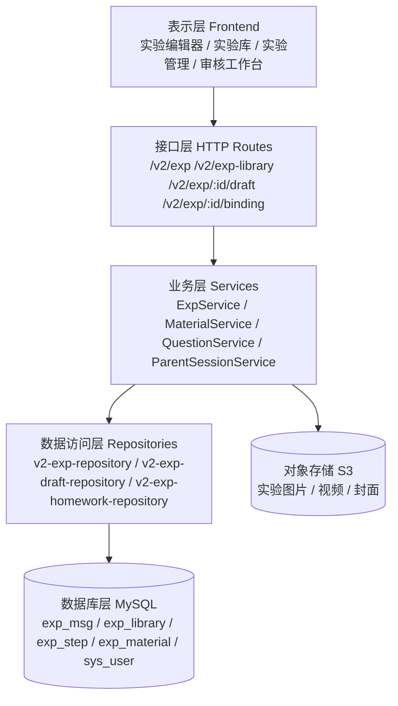
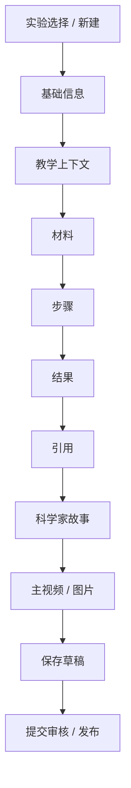
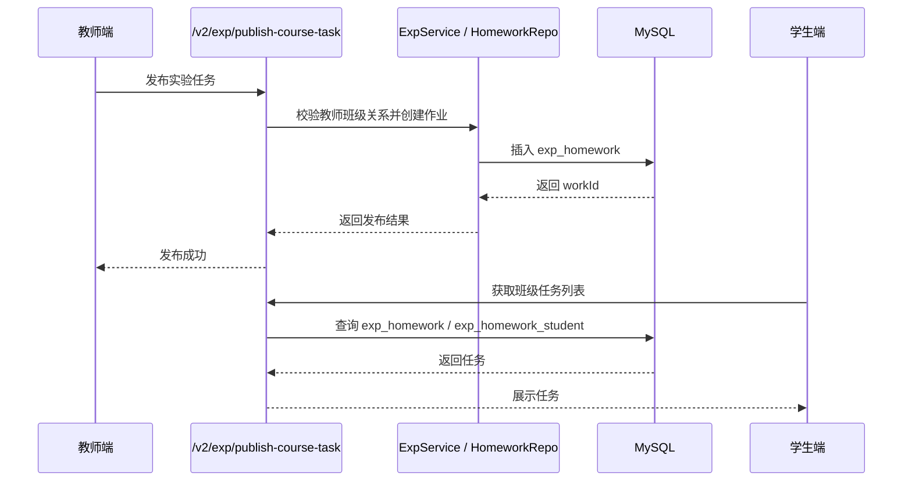

# V2 实验业务详细设计文档

- 版本：1.1
- 最后更新：2026-05-06
- 维护人：架构组

> **提示**
> 本文为当前正式版本，历史版本已归档至 `docs/archive/`。

## 目录

1. 项目概述
2. 设计目标与术语定义
3. 总体架构设计
4. 代码结构全量真实清单
5. 数据库与实体映射
6. 接口级真实清单
7. 前端页面与交互设计
8. 核心业务流程
9. 关键规则与约束
10. 异常处理与错误码
11. 可维护性与扩展性说明
12. 附录：文件索引

---

## 1. 项目概述

### 1.1 项目背景

V2 实验业务模块用于支撑实验内容的创建、编辑、审核、发布、分发、使用与反馈闭环。系统以实验主表 `exp_msg` 和标准实验库 `exp_library` 为核心，围绕教材、学科、学段、年级、材料、步骤、结果、引用、科学家故事、视频、图片等结构化对象组织数据。

当前仓库已经形成完整的前后端映射：

- 后端路由：`backend/src/http/routes/v2-exp.ts`
- 后端服务：`backend/src/services/ExpService.ts`
- 后端草稿仓库：`backend/src/infrastructure/repositories/v2-exp-draft-repository.ts`
- 后端实验仓库：`backend/src/infrastructure/repositories/v2-exp-repository.ts`
- 后端作业仓库：`backend/src/infrastructure/repositories/v2-exp-homework-repository.ts`
- 前端 API：`frontend/src/lib/v2/v2-exp-api.ts`
- 前端实验编辑器：`frontend/src/app/(dashboard)/teacher/experiment-editor/`
- 数据库设计：`docs/core/bs_exp_data-database-design.md`
- 数据库迁移：`database/migrations/bs_exp_data.sql`

### 1.2 系统定位

本模块不是单一 CRUD 页面，而是一个“实验资源生产与流转系统”。它覆盖以下能力：

> **提示**
> 下文涉及的路由、服务、仓库、页面与 hooks 均以当前仓库真实文件为准；若文件迁移或重命名，应同步修订本章对应清单。

- 标准实验库沉淀
- 教师实验草稿编辑
- 实验审核与发布
- 教材章节绑定
- 班级作业分发
- 社交行为统计
- 家校协同延展

---

## 2. 设计目标与术语

### 2.1 设计目标

#### 2.1.1 功能性目标

- 支持标准实验库与实验实例双模型
- 支持教师创建、编辑、保存草稿、提交审核、发布使用
- 支持实验内容结构化拆分与聚合回填
- 支持教材、章节、小节与实验绑定
- 支持材料、步骤、结果、引用、科学家故事、视频、图片等扩展内容
- 支持课程任务分发与班级关联
- 支持实验审核通过、驳回与重新编辑

#### 2.1.2 非功能性目标

- 一致性：字段命名、接口体、数据库结构统一对齐
- 可维护性：主表 + 子表拆分清晰，便于扩展
- 可审计性：保留创建人、更新人、审核人、时间信息
- 可扩展性：支持继续增加实验子表和任务流转能力
- 可用性：草稿可重复保存，驳回后可重新提交

### 2.2 术语定义

| 术语 | 说明 |
| --- | --- |
| 标准实验库 | `exp_library`，沉淀标准模板与适用年级 |
| 实验实例 | `exp_msg`，教师或学生实际创建的实验内容 |
| 草稿 | `status = t`，可编辑状态 |
| 已通过 | `status = y`，审核通过状态 |
| 已驳回 | `status = n`，审核不通过状态 |
| 整包保存 | `PUT /v2/exp/:id/draft` 对主表与子表整体写入 |
| 子表重建 | 保存草稿时对出现的子表数组先删后插 |
| 任务分发 | 将实验发布到班级，生成作业记录 |
| 合并策略 | 从关联实验自动填充时的数据合并方式：`replace`（覆盖）、`mergeIfEmpty`（仅填充空字段）、`merge`（追加+去重）。详见 8.2.2 |

---

## 3. 总体架构

### 3.1 分层架构



> **注意**
> 该图仅表达当前实验业务主链路，不等同于全仓库架构图。

### 3.2 业务链路架构


---

## 4. 代码结构

本章按仓库中与实验业务直接相关的真实文件逐项列出，并按后端接口、后端服务、后端仓库、前端页面、前端 hooks、前端 utils、前端 types、前端 API 分类。

### 4.1 后端接口真实清单

#### 4.1.1 实验相关路由

- `backend/src/http/routes/v2-exp.ts`
- `backend/src/http/routes/v2-review.ts`
- `backend/src/http/routes/v2-question.ts`
- `backend/src/http/routes/v2-homework.ts`
- `backend/src/http/routes/v2-material.ts`
- `backend/src/http/routes/v2-coursebook.ts`
- `backend/src/http/routes/v2-class.ts`
- `backend/src/http/routes/v2-parent.ts`
- `backend/src/http/routes/v2-student.ts`
- `backend/src/http/routes/v2-social.ts`
- `backend/src/http/routes/v2-file.ts`
- `backend/src/http/routes/v2-dict.ts`
- `backend/src/http/routes/v2-business-dict.ts`
- `backend/src/http/routes/v2-admin-dict.ts`
- `backend/src/http/routes/v2-admin-user.ts`
- `backend/src/http/routes/v2-auth.ts`
- `backend/src/http/routes/v2-role-permission.ts`
- `backend/src/http/routes/v2-sys.ts`
- `backend/src/http/routes/v2-sys-log.ts`
- `backend/src/http/routes/v2-sys-feedback.ts`
- `backend/src/http/routes/v2-sys-org.ts`
- `backend/src/http/routes/v2-sys-org-types.ts`
- `backend/src/http/routes/v2-sys-org-create-scope.ts`
- `backend/src/http/routes/v2-sys-role.ts`
- `backend/src/http/routes/v2-teacher-class-config.ts`
- `backend/src/http/routes/v2-teacher-material-types.ts`
- `backend/src/http/routes/v2-scale-admin-routes.ts`
- `backend/src/http/routes/v2-feedback-auto-submit.ts`
- `backend/src/http/routes/v2-ops-cache.ts`
- `backend/src/http/routes/v2-ops-consistency.ts`
- `backend/src/http/routes/v2-ops-data-export.ts`
- `backend/src/http/routes/v2-ops-dict-sync.ts`
- `backend/src/http/routes/v2-version.ts`
- `backend/src/http/routes/group.ts`

#### 4.1.2 说明

`v2-exp.ts` 是实验模块主入口路由，其他路由文件提供字典、素材、班级、审核、权限、组织与系统支撑能力。

### 4.2 后端服务真实清单

- `backend/src/services/ExpService.ts`
- `backend/src/services/ExpService.test.ts`
- `backend/src/services/MaterialService.ts`
- `backend/src/services/QuestionService.ts`
- `backend/src/services/ClassService.ts`
- `backend/src/services/OrgService.ts`
- `backend/src/services/ParentBindingService.ts`
- `backend/src/services/ParentSessionService.ts`
- `backend/src/services/ParentTaskService.ts`
- `backend/src/services/StudentService.ts`
- `backend/src/services/SubjectTagService.ts`
- `backend/src/services/SystemLogService.ts`
- `backend/src/services/TeacherClassService.ts`
- `backend/src/services/MsgPushService.ts`

### 4.3 后端仓库真实清单

#### 4.3.1 实验主数据与草稿

- `backend/src/infrastructure/repositories/v2-exp-repository.ts`
- `backend/src/infrastructure/repositories/v2-exp-draft-repository.ts`
- `backend/src/infrastructure/repositories/v2-exp-homework-repository.ts`

#### 4.3.2 课程与教材

- `backend/src/infrastructure/repositories/v2-coursebook-repository.ts`
- `backend/src/infrastructure/repositories/v2-grade-subject-repository.ts`
- `backend/src/infrastructure/repositories/v2-teacher-subject-repository.ts`

#### 4.3.3 材料、文件与社交

- `backend/src/infrastructure/repositories/v2-material-repository.ts`
- `backend/src/infrastructure/repositories/v2-file-repository.ts`
- `backend/src/infrastructure/repositories/v2-social-repository.ts`

#### 4.3.4 用户、组织、权限与系统

- `backend/src/infrastructure/repositories/v2-sys-user-repository.ts`
- `backend/src/infrastructure/repositories/v2-sys-org-repository.ts`
- `backend/src/infrastructure/repositories/v2-sys-org-type-repository.ts`
- `backend/src/infrastructure/repositories/v2-sys-org-school-grade-repository.ts`
- `backend/src/infrastructure/repositories/v2-sys-org-teacher-classes-repository.ts`
- `backend/src/infrastructure/repositories/v2-sys-org-tree-scope.ts`
- `backend/src/infrastructure/repositories/v2-sys-role-repository.ts`
- `backend/src/infrastructure/repositories/v2-role-permission-repository.ts`
- `backend/src/infrastructure/repositories/v2-sys-log-repository.ts`
- `backend/src/infrastructure/repositories/v2-sys-feedback-repository.ts`
- `backend/src/infrastructure/repositories/v2-user-context-repository.ts`

#### 4.3.5 家长、学生、作业与课题组

- `backend/src/infrastructure/repositories/v2-parent-session-repository.ts`
- `backend/src/infrastructure/repositories/v2-parent-task-repository.ts`
- `backend/src/infrastructure/repositories/v2-parent-report-repository.ts`
- `backend/src/infrastructure/repositories/v2-parent-student-rel-repository.ts`
- `backend/src/infrastructure/repositories/v2-student-task-repository.ts`
- `backend/src/infrastructure/repositories/v2-student-footprints-repository.ts`
- `backend/src/infrastructure/repositories/v2-homework-repository.ts`
- `backend/src/infrastructure/repositories/subject-group-repository.ts`

#### 4.3.6 字典与管理类仓库

- `backend/src/infrastructure/repositories/v2-dict-repository.ts`
- `backend/src/infrastructure/repositories/v2-business-dict-repository.ts`
- `backend/src/infrastructure/repositories/v2-admin-dict-repository.ts`
- `backend/src/infrastructure/repositories/v2-dict-audit-log.ts`
- `backend/src/infrastructure/repositories/v2-scale-admin-repository.ts`
- `backend/src/infrastructure/repositories/v2-teacher-class-repository.ts`
- `backend/src/infrastructure/repositories/v2-teacher-class-conflict-repository.ts`
- `backend/src/infrastructure/repositories/v2-teacher-material-type-repository.ts`

### 4.4 后端域类型真实清单

- `backend/src/domain/v2-exp/v2-exp-types.ts`
- `backend/src/domain/v2-file/v2-file-types.ts`
- `backend/src/domain/v2-file/v2-file-poster-upload.ts`
- `backend/src/domain/v2-file/v2-file-data-repair.ts`
- `backend/src/domain/v2-file/data-file-logo-url.ts`
- `backend/src/domain/v2-file/data-file-thumbnail-finalize.ts`
- `backend/src/domain/v2-file/v2-file-extension-kind-map.ts`
- `backend/src/domain/v2-file/v2-file-extension-groups.json`
- `backend/src/domain/v2-file/v2-file-extension-groups.local.example.json`
- `backend/src/domain/v2-material/v2-material-types.ts`
- `backend/src/domain/v2-question/v2-question-types.ts`
- `backend/src/domain/v2-social/v2-social-types.ts`
- `backend/src/domain/v2-homework/v2-homework-types.ts`
- `backend/src/domain/v2-parent/v2-parent-session-types.ts`
- `backend/src/domain/v2-parent/v2-parent-task-types.ts`
- `backend/src/domain/v2-group/v2-group-types.ts`
- `backend/src/domain/v2-student/v2-student-footprints-types.ts`
- `backend/src/domain/v2-student/v2-student-task-types.ts`
- `backend/src/domain/v2-sys/v2-sys-types.ts`
- `backend/src/domain/v2-sys/v2-sys-role-types.ts`
- `backend/src/domain/v2-sys/v2-role-constants.ts`
- `backend/src/domain/v2-sys/v2-org-type-constants.ts`
- `backend/src/domain/v2-sys/v2-msg-constants.ts`
- `backend/src/domain/v2-sys/teaching-user-role-bind.ts`

### 4.5 后端基础能力真实清单

- `backend/src/infrastructure/mysql/mysql-client.ts`
- `backend/src/infrastructure/ids/identifiable-varchar32.ts`
- `backend/src/infrastructure/ids/identifiable-varchar32.test.ts`
- `backend/src/infrastructure/storage/s3-storage.ts`
- `backend/src/infrastructure/storage/s3-feedback-storage.ts`
- `backend/src/infrastructure/storage/s3-multipart.ts`
- `backend/src/lib/auth/page-permissions.ts`
- `backend/src/lib/auth/permission-guard.ts`
- `backend/src/lib/auth/role-permissions.ts`
- `backend/src/lib/auth/v2-session.ts`
- `backend/src/lib/presign-response.ts`
- `backend/src/utils/text.ts`
- `backend/src/http/server.ts`

### 4.6 前端页面真实清单

#### 4.6.1 教师实验编辑器

- `frontend/src/app/(dashboard)/teacher/experiment-editor/page.tsx`
- `frontend/src/app/(dashboard)/teacher/experiment-editor/page.container.tsx`
- `frontend/src/app/(dashboard)/teacher/experiment-editor/page.constants.ts`
- `frontend/src/app/(dashboard)/teacher/experiment-editor/types.ts`

#### 4.6.2 教师实验编辑器组件

- `frontend/src/app/(dashboard)/teacher/experiment-editor/_components/EditorCanvas.tsx`
- `frontend/src/app/(dashboard)/teacher/experiment-editor/_components/EditorCanvasSections.tsx`
- `frontend/src/app/(dashboard)/teacher/experiment-editor/_components/EditorCompletionRing.tsx`
- `frontend/src/app/(dashboard)/teacher/experiment-editor/_components/EditorHeader.tsx`
- `frontend/src/app/(dashboard)/teacher/experiment-editor/_components/EditorNavTopTools.tsx`
- `frontend/src/app/(dashboard)/teacher/experiment-editor/_components/EditorOutlinePanel.tsx`
- `frontend/src/app/(dashboard)/teacher/experiment-editor/_components/EditorPropertyPanel.tsx`
- `frontend/src/app/(dashboard)/teacher/experiment-editor/_components/EditorTabNav.tsx`
- `frontend/src/app/(dashboard)/teacher/experiment-editor/_components/EditorThreePaneLayout.tsx`
- `frontend/src/app/(dashboard)/teacher/experiment-editor/_components/EditorToolbar.tsx`
- `frontend/src/app/(dashboard)/teacher/experiment-editor/_components/ExperimentEditorShell.tsx`
- `frontend/src/app/(dashboard)/teacher/experiment-editor/_components/ExperimentPickerDialog.tsx`
- `frontend/src/app/(dashboard)/teacher/experiment-editor/_components/ExperimentalMaterialsPickerDialog.tsx`
- `frontend/src/app/(dashboard)/teacher/experiment-editor/_components/ResultEntryItem.tsx`
- `frontend/src/app/(dashboard)/teacher/experiment-editor/_components/ResultEntryList.tsx`
- `frontend/src/app/(dashboard)/teacher/experiment-editor/_components/SafetyPresetChips.tsx`
- `frontend/src/app/(dashboard)/teacher/experiment-editor/_components/StageCanvas.tsx`
- `frontend/src/app/(dashboard)/teacher/experiment-editor/_components/StepExperimentalMaterialFormDialog.tsx`
- `frontend/src/app/(dashboard)/teacher/experiment-editor/_components/StepItem.tsx`
- `frontend/src/app/(dashboard)/teacher/experiment-editor/_components/StepMaterialEditDialog.tsx`
- `frontend/src/app/(dashboard)/teacher/experiment-editor/_components/StepMaterialsBulkInput.tsx`
- `frontend/src/app/(dashboard)/teacher/experiment-editor/_components/StepMaterialsLibraryPanel.tsx`
- `frontend/src/app/(dashboard)/teacher/experiment-editor/_components/StepMaterialsPanel.tsx`
- `frontend/src/app/(dashboard)/teacher/experiment-editor/_components/StepSidebar.tsx`
- `frontend/src/app/(dashboard)/teacher/experiment-editor/_components/StepContentRichEditor.tsx`
- `frontend/src/app/(dashboard)/teacher/experiment-editor/_components/TeachingContextBulkInput.tsx`
- `frontend/src/app/(dashboard)/teacher/experiment-editor/_components/TeachingContextStructuredFields.tsx`
- `frontend/src/app/(dashboard)/teacher/experiment-editor/_components/ToolboxPanel.tsx`
- `frontend/src/app/(dashboard)/teacher/experiment-editor/_components/sections/EditorBasicSection.tsx`
- `frontend/src/app/(dashboard)/teacher/experiment-editor/_components/sections/EditorBasicSettingsRow.tsx`
- `frontend/src/app/(dashboard)/teacher/experiment-editor/_components/sections/EditorExpPickerBar.tsx`
- `frontend/src/app/(dashboard)/teacher/experiment-editor/_components/sections/EditorMainVideoSection.tsx`
- `frontend/src/app/(dashboard)/teacher/experiment-editor/_components/sections/EditorMaterialsSection.tsx`
- `frontend/src/app/(dashboard)/teacher/experiment-editor/_components/sections/EditorOcrSection.tsx`
- `frontend/src/app/(dashboard)/teacher/experiment-editor/_components/sections/EditorPrincipleSection.tsx`
- `frontend/src/app/(dashboard)/teacher/experiment-editor/_components/sections/EditorScientistStoryPanel.tsx`
- `frontend/src/app/(dashboard)/teacher/experiment-editor/_components/sections/EditorStepsSection.tsx`
- `frontend/src/app/(dashboard)/teacher/experiment-editor/_components/sections/EditorSubjectSection.tsx`
- `frontend/src/app/(dashboard)/teacher/experiment-editor/_components/sections/EditorTailSections.tsx`
- `frontend/src/app/(dashboard)/teacher/experiment-editor/_components/sections/EditorTeachingContextSection.tsx`
- `frontend/src/app/(dashboard)/teacher/experiment-editor/_components/sections/EditorExperimentReferencePanel.tsx`
- `frontend/src/app/(dashboard)/teacher/experiment-editor/_components/sections/EditorMediaManagerFields.tsx`
- `frontend/src/app/(dashboard)/teacher/experiment-editor/_components/sections/EditorVideoPreviewPanel.tsx`

### 4.7 前端 hooks 真实清单

- `frontend/src/app/(dashboard)/teacher/experiment-editor/hooks/editor-bootstrap-utils.ts`
- `frontend/src/app/(dashboard)/teacher/experiment-editor/hooks/use-canvas-state.ts`
- `frontend/src/app/(dashboard)/teacher/experiment-editor/hooks/use-editor-actions.ts`
- `frontend/src/app/(dashboard)/teacher/experiment-editor/hooks/use-editor-autosave.ts`
- `frontend/src/app/(dashboard)/teacher/experiment-editor/hooks/use-editor-bootstrap.ts`
- `frontend/src/app/(dashboard)/teacher/experiment-editor/hooks/use-editor-bootstrap-checklist.ts`
- `frontend/src/app/(dashboard)/teacher/experiment-editor/hooks/use-editor-bootstrap-curriculum-table.tsx`
- `frontend/src/app/(dashboard)/teacher/experiment-editor/hooks/use-editor-bootstrap-flags.ts`
- `frontend/src/app/(dashboard)/teacher/experiment-editor/hooks/use-editor-bootstrap-hydrate.ts`
- `frontend/src/app/(dashboard)/teacher/experiment-editor/hooks/use-editor-bootstrap-phase-sync.ts`
- `frontend/src/app/(dashboard)/teacher/experiment-editor/hooks/use-editor-bootstrap-runtime.ts`
- `frontend/src/app/(dashboard)/teacher/experiment-editor/hooks/use-editor-bootstrap-standard-prefill.tsx`
- `frontend/src/app/(dashboard)/teacher/experiment-editor/hooks/use-editor-history.ts`
- `frontend/src/app/(dashboard)/teacher/experiment-editor/hooks/use-editor-store.ts`
- `frontend/src/app/(dashboard)/teacher/experiment-editor/hooks/use-editor-v2-peer-data.ts`
- `frontend/src/app/(dashboard)/teacher/experiment-editor/hooks/use-result-entries-management.ts`

### 4.8 前端 utils 真实清单

- `frontend/src/app/(dashboard)/teacher/experiment-editor/utils/build-editor-hydration-from-v2-detail.ts`
- `frontend/src/app/(dashboard)/teacher/experiment-editor/utils/build-editor-hydration-from-v2-library.ts`
- `frontend/src/app/(dashboard)/teacher/experiment-editor/utils/build-v2-exp-draft-put-body.ts`
- `frontend/src/app/(dashboard)/teacher/experiment-editor/utils/exp-editor-text-fences.ts`
- `frontend/src/app/(dashboard)/teacher/experiment-editor/utils/parse-materials-from-text.ts`
- `frontend/src/app/(dashboard)/teacher/experiment-editor/utils/reference-citation-filled.ts`
- `frontend/src/app/(dashboard)/teacher/experiment-editor/utils/resolve-exp-list-filter-query.ts`
- `frontend/src/app/(dashboard)/teacher/experiment-editor/utils/resolve-exp-taxonomy-ids.ts`
- `frontend/src/app/(dashboard)/teacher/experiment-editor/utils/step-content-filled.ts`
- `frontend/src/app/(dashboard)/teacher/experiment-editor/utils/editor-peer-row-types.ts`

### 4.9 前端 API 与业务库真实清单

- `frontend/src/lib/v2/v2-exp-api.ts`
- `frontend/src/lib/v2/v2-homework-api.ts`
- `frontend/src/lib/v2/v2-material-api.ts`
- `frontend/src/lib/v2/v2-review-api.ts`
- `frontend/src/lib/v2/v2-file-api.ts`
- `frontend/src/lib/v2/v2-sys-api.ts`
- `frontend/src/lib/v2/v2-dict-adapter.ts`
- `frontend/src/lib/experiment-autofill/applyToForm.ts`
- `frontend/src/lib/experiment-autofill/buildPayload.ts`
- `frontend/src/lib/experiment-autofill/index.ts`
- `frontend/src/lib/promote-experiment-standard.ts`
- `frontend/src/lib/standard-experiments-api.ts`
- `frontend/src/lib/experiment-catalog-api.ts`
- `frontend/src/lib/experiment-mgmt-mock-store.ts`
- `frontend/src/lib/experiment-editor-ai-outline-prefill.ts`

### 4.10 前端类型真实清单

- `frontend/src/types/experiment.ts`
- `frontend/src/types/experiment-detail.ts`
- `frontend/src/types/experiment-link.ts`
- `frontend/src/types/org.ts`
- `frontend/src/types/resource.ts`
- `frontend/src/types/student-work.ts`
- `frontend/src/types/subject.ts`
- `frontend/src/types/question-bank.ts`
- `frontend/src/types/auth.ts`
- `frontend/src/types/feedback.ts`
- `frontend/src/types/tree.ts`
- `frontend/src/types/experiment-view-permissions.ts`
- `frontend/src/types/inbox-message.ts`
- `frontend/src/types/parent-contract.ts`
- `frontend/src/types/curriculum-standard.ts`

### 4.11 前端与实验相关的辅助页面

- `frontend/src/app/(dashboard)/experiment-manage/page.tsx`
- `frontend/src/app/(dashboard)/experiment-manage/page.container.tsx`
- `frontend/src/app/(dashboard)/experiment-manage/page.hooks.ts`
- `frontend/src/app/(dashboard)/experiment-manage/layout.tsx`
- `frontend/src/app/(dashboard)/experiments/page.tsx`
- `frontend/src/app/(dashboard)/experiments/page.hooks.ts`
- `frontend/src/app/(dashboard)/experiments/[id]/page.tsx`
- `frontend/src/app/(dashboard)/console/settings/experiments/page.tsx`
- `frontend/src/app/(dashboard)/console/settings/experiments/page.hooks.ts`
- `frontend/src/app/(dashboard)/console/settings/experiments/fetch-all-catalog-experiments.ts`
- `frontend/src/app/(dashboard)/console/settings/experiments/_components/experiment-catalog-page-view.tsx`
- `frontend/src/app/(dashboard)/console/settings/experiments/_components/experiment-detail-sheet.tsx`
- `frontend/src/app/(dashboard)/console/settings/experiments/_components/experiment-detail-core-edit-panel.tsx`
- `frontend/src/app/(dashboard)/console/settings/experiments/_components/experiment-detail-core-section.tsx`
- `frontend/src/app/(dashboard)/console/settings/experiments/_components/experiment-detail-core-fields.tsx`
- `frontend/src/app/(dashboard)/console/review/experiments/page.tsx`
- `frontend/src/app/(dashboard)/console/review/experiments/experiment-review-submit.ts`
- `frontend/src/app/(dashboard)/console/review/experiments/experiment-curriculum-review-screen.tsx`

### 4.12 相关公共组件清单

- `frontend/src/components/business/experiment-detail/experiment-hub-view.tsx`
- `frontend/src/components/business/experiment-detail/experiment-layout.tsx`
- `frontend/src/components/business/experiment-detail-content.tsx`
- `frontend/src/components/business/experiment-card.tsx`
- `frontend/src/components/business/experiment-course/experiment-course-shell.tsx`
- `frontend/src/components/business/experiment-course/common-form-sections.tsx`
- `frontend/src/components/business/experiment-manage/ExperimentCourseCardMenus.tsx`
- `frontend/src/components/business/experiment-manage/ExperimentCourseCardCommentDialog.tsx`
- `frontend/src/components/business/experiment-manage/ExperimentCourseVideoCard.tsx`
- `frontend/src/components/business/experiment-manage/ExpMsgCoverPreview.tsx`
- `frontend/src/components/business/media/MediaAssetGridPicker.tsx`
- `frontend/src/components/business/media/MediaAssetPickerDialog.tsx`
- `frontend/src/components/business/media/MediaPreviewCard.tsx`
- `frontend/src/components/business/media/MediaRegistryImageField.tsx`
- `frontend/src/components/business/media/MediaRegistryVideoField.tsx`
- `frontend/src/components/business/video/ExpVideoPlayer.tsx`
- `frontend/src/components/business/video/ExpVideoPlayer.hooks.ts`
- `frontend/src/components/business/video/exp-video-player-content-start.ts`
- `frontend/src/components/business/video/exp-video-player-poster-effects.ts`
- `frontend/src/components/business/video/exp-video-player-poster-persist.ts`
- `frontend/src/components/business/video/exp-video-player-playback.ts`
- `frontend/src/components/business/video/exp-video-player-state.ts`

### 4.13 说明

本章的清单已经尽量按“真实文件”而非“模块抽象”方式列出。若仓库新增、重命名或拆分文件，本章应作为文档同步维护的第一对象。

---

## 5. 数据库映射

### 5.1 核心实体

| 实体 | 对应数据库表 | 说明 |
| --- | --- | --- |
| 标准实验库 | `exp_library` | 标准模板 |
| 实验主表 | `exp_msg` | 核心实验实体 |
| 教材 | `data_coursebook` | 教材主数据 |
| 教材章 | `data_coursebook_chapter` | 教材章节 |
| 教材节 | `data_coursebook_unit` | 教材小节 |
| 实验步骤 | `exp_step` | 步骤内容 |
| 实验材料 | `exp_material` | 材料清单 |
| 实验结果 | `exp_result` | 结果说明 |
| 实验引用 | `exp_reference` | 引用来源 |
| 实验科学家故事 | `exp_scientist` | 科学家故事 |
| 实验视频 | `exp_video` | 视频资源 |
| 实验图片 | `exp_pic` | 图片资源 |
| 实验作业 | `exp_homework` | 分发任务 |
| 学生作业 | `exp_homework_student` | 学生作业快照 |

### 5.2 主键与外键策略

- 业务主键大多采用 `varchar(32)`。
- 子表通常按父表外键拆分。
- 实验主表通过 `subject_id`、`grade_id`、`coursebook_id`、`unit_id` 等字段绑定教育体系。
- `exp_msg.standard_exp_id` 外键指向 `exp_library.lib_exp_id`，用于标准实验库复用。
- `exp_msg.confirm_user_id`、`exp_msg.confirm_time`、`exp_msg.confirm_comments` 分别表示审核人、审核时间与审核意见。

---

## 6. 接口设计

本章按真实路由文件整理实验业务接口，并结合仓库中的服务和仓储实现说明其职责。

### 6.1 `backend/src/http/routes/v2-exp.ts`

#### 6.1.1 接口职责

实验模块主路由，负责：

- 实验列表
- 实验创建
- 实验详情
- 草稿保存
- 实验审核
- 课程任务分发
- 标准实验库 CRUD
- 教材挂载
- 实验统计

#### 6.1.2 真实接口清单

- `GET /v2/exp`
- `POST /v2/exp`
- `GET /v2/exp/stats`
- `GET /v2/exp/:id`
- `PATCH /v2/exp/:id`
- `PUT /v2/exp/:id/draft`
- `PATCH /v2/exp/:id/binding`
- `POST /v2/exp/publish-course-task`
- `POST /v2/exp/publish-coursebook-tasks`
- `GET /v2/exp-library`
- `POST /v2/exp-library`
- `GET /v2/exp-library/:id`
- `PATCH /v2/exp-library/:id`

#### 6.1.3 对应服务与仓库

- `getExpList` → `backend/src/services/ExpService.ts`
- `getExpDetail` → `backend/src/services/ExpService.ts`
- `getExpStats` → `backend/src/services/ExpService.ts`
- `saveExp` → `backend/src/services/ExpService.ts`
- `bindExpToUnit` → `backend/src/services/ExpService.ts`
- `putExpMsgDraft` → `backend/src/infrastructure/repositories/v2-exp-draft-repository.ts`
- `insertExpHomework` / `assertTeacherClassRelation` → `backend/src/infrastructure/repositories/v2-exp-homework-repository.ts`
- `listExpLibrary` / `getExpLibraryById` / `createExpLibrary` / `patchExpLibrary` → `backend/src/infrastructure/repositories/v2-exp-repository.ts`

### 6.2 `backend/src/http/routes/v2-review.ts`

#### 6.2.1 职责

实验与其他业务的审核入口，承载审核工作台相关能力。

### 6.3 `backend/src/http/routes/v2-coursebook.ts`

#### 6.3.1 职责

教材、章节、小节查询与管理，供实验绑定教材体系使用。

### 6.4 `backend/src/http/routes/v2-material.ts`

#### 6.4.1 职责

实验材料、材料预览、材料检索与管理接口。

### 6.5 `backend/src/http/routes/v2-file.ts`

#### 6.5.1 职责

文件上传、封面、视频、预签名 URL 与资源存储处理。

### 6.6 `backend/src/http/routes/v2-class.ts`

#### 6.6.1 职责

班级信息、教师班级、班级分发关系处理。

### 6.7 `backend/src/http/routes/v2-parent.ts`

#### 6.7.1 职责

家长会话、家校协同、父子关系、报告能力。

### 6.8 `backend/src/http/routes/v2-student.ts`

#### 6.8.1 职责

学生视图、学生任务、实验足迹与使用记录。

### 6.9 `backend/src/http/routes/v2-social.ts`

#### 6.9.1 职责

点赞、倒赞、收藏、评价等实验社交行为。

### 6.10 `backend/src/http/routes/v2-question.ts`

#### 6.10.1 职责

题目与能力维度，为实验衍生题库和评测功能提供支撑。

### 6.11 `backend/src/http/routes/v2-auth.ts`

#### 6.11.1 职责

登录、会话、权限和角色相关接口。

### 6.12 `backend/src/http/routes/v2-sys.ts`、`v2-sys-role.ts`、`v2-sys-org.ts`、`v2-sys-user.ts`

#### 6.12.1 职责

系统用户、组织、角色、权限、组织树、组织类型维护。

---

## 7. 前端设计

### 7.1 核心页面

- `frontend/src/app/(dashboard)/teacher/experiment-editor/page.tsx`
- `frontend/src/app/(dashboard)/teacher/experiment-editor/page.container.tsx`
- `frontend/src/app/(dashboard)/experiment-manage/page.tsx`
- `frontend/src/app/(dashboard)/experiments/page.tsx`
- `frontend/src/app/(dashboard)/experiments/[id]/page.tsx`
- `frontend/src/app/(dashboard)/console/settings/experiments/page.tsx`
- `frontend/src/app/(dashboard)/console/review/experiments/page.tsx`

### 7.2 编辑器交互结构



### 7.3 前端状态分层

- 页面容器层：控制路由参数、初始化、权限
- 编辑器壳层：承载三栏布局
- 业务区块层：基础、材料、步骤、结果、引用等
- hooks 层：状态管理、自动保存、回填、联动
- utils 层：表单映射、数据清洗、结构化转换

### 7.4 前端状态管理方案

当前实验编辑器主要通过自定义 hooks + 本地 store 的方式管理状态，核心入口包括：

- `frontend/src/app/(dashboard)/teacher/experiment-editor/hooks/use-editor-store.ts`
- `frontend/src/app/(dashboard)/teacher/experiment-editor/hooks/use-editor-actions.ts`
- `frontend/src/app/(dashboard)/teacher/experiment-editor/hooks/use-editor-bootstrap.ts`
- `frontend/src/app/(dashboard)/teacher/experiment-editor/hooks/use-editor-autosave.ts`

设计特征：

- 以页面级状态为主，不依赖全局 Redux
- 通过 store 统一管理编辑器草稿、当前选中块、脏状态、协同数据
- 通过 actions 封装对步骤、材料、结果、引用等集合的增删改
- 通过 bootstrap hooks 完成详情回填与标准库预填

---

## 8. 核心流程

### 8.1 标准实验库到实验草稿

1. 教师在标准实验库中选择模板
2. 前端调用标准库详情或列表数据
3. `build-editor-hydration-from-v2-library` 生成草稿初始值
4. 编辑器渲染并允许二次修改

### 8.2 实验草稿保存

1. 用户编辑实验内容
2. 前端调用 `build-v2-exp-draft-put-body.ts`
3. 提交到 `PUT /v2/exp/:id/draft`
4. 后端更新主表并重建子表
5. 返回最新详情供前端刷新

#### 8.2.1 自动保存规则

- 自动保存由 `use-editor-autosave.ts` 触发
- 内容变更后进行防抖提交，避免高频写库
- 页面处于编辑态时定期同步草稿状态
- 若用户连续输入，按最近一次变更重新计时
- 自动保存与手动保存共用同一数据构建逻辑

#### 8.2.2 关联实验填充与合并策略

当用户关联一个已审核通过（`status = y`）的实验时，前端按以下逻辑填充数据：

1. **策略选择**：前端根据当前编辑器的编辑状态自动选择策略：
   - `replace`（覆盖）：用户尚未编辑任何内容（子表只有默认值、主表字段为空），全量替换为关联实验的数据。
   - `merge`（追加+去重）：用户已有自定义编辑内容，对子表数组字段执行追加+去重，非数组非空字段保留原值。
   - `mergeIfEmpty`：仅填充当前为空的字段，已经在使用中较少触发。

2. **字段映射**：
   - `summary`、`curriculum`、`teachingContextContent` 从 `exp_msg.exp_principle` 的 HTML 注释围栏中解析（见 `exp-editor-text-fences.ts`）。
   - `safetyNotes` 映射 `exp_msg.exp_caution`、`dangerNotes` 映射 `exp_msg.exp_danger`，均为数据库独立字段，不再从 `exp_principle` 取值。
   - `curriculum` 不再错误映射 `coursebookId`。

3. **关联实验列表过滤**：`GET /v2/exp-library` 调用自动附带 `status: 'y'` 参数，仅返回审核通过的实验可供关联。草稿（`t`）和已驳回（`n`）的实验不出现。

#### 8.2.3 子表合并（merge）算法

- 对 `materials`、`steps`、`resultEntries`、`referenceCitations`、`scientistStories` 数组字段执行追加+去重。
- 去重依据：
  - `steps`：按 `stepName` 与本地 `title` 比较（同名的步骤不追加）。
  - `materials`：按 `materialId`（材料库 ID）与本地 `libraryMaterialId` 比较。
  - `resultEntries`：按 `resultName` 与本地 `title` 比较。
  - `referenceCitations`：按 `referenceName` 与本地 `citedExperimentTitle` 比较。
  - `scientistStories`：按 `scientistName` 比较。
- 非数组字段：若当前值为空则填充，非空则保留。

### 8.3 实验审核

1. 审核员进入审核工作台
2. 调用实验详情接口查看完整内容
3. 执行通过或驳回
4. 后端写入审核人、时间与意见

### 8.4 课程任务分发

1. 教师选择班级
2. 调用课程任务分发接口
3. 后端校验教师班级关系
4. 创建作业记录
5. 班级端可继续消费任务



---

## 9. 规则与约束

### 9.1 状态规则

#### 9.1.1 `exp_msg.status`

- `t`：草稿，可编辑
- `y`：已通过，不应直接覆盖
- `n`：已驳回，可修改后重新提审

#### 9.1.2 `exp_library.status`

- `t`：草稿
- `y`：发布
- `n`：停用

#### 9.1.3 审核字段说明

- `confirm_user_id`：审核人 ID
- `confirm_time`：审核时间
- `confirm_comments`：审核意见；通过或驳回时均可记录

### 9.2 权限规则

- 草稿整包写入必须由创建人或有编辑权限角色发起
- 审核必须具备审核权限
- 课程分发必须校验教师与班级关系

### 9.3 子表保存规则

#### 9.3.1 后端保存规则

- 请求体中出现的子表数组才会被处理
- 空数组表示清空该子表
- 未出现的子表不变更
- 删除子表前需先处理其下游依赖记录，避免在外键约束下直接删除失败
- 当某子表存在深层依赖时，应优先删除依赖子表，再删除父子表记录

#### 9.3.2 前端合并规则（关联实验填充时）

当用户关联已发布实验且当前编辑器含有已编辑内容时，前端采用 `merge` 策略而非 `replace`：

1. **子表字段（数组）**：追加 + 去重（同名/同材料库 ID 的不重复追加）。
2. **非数组字段**：当前值为空则填充，非空则保留用户已有内容。
3. **主表字段映射**：`summary`、`curriculum`、`teachingContextContent` 从 `exp_principle` 的 HTML 围栏解析；`safetyNotes`/`dangerNotes` 使用独立的 `exp_caution`/`exp_danger` 数据库字段。
4. **实现文件**：
   - `frontend/src/lib/experiment-autofill/buildPayload.ts` — 构建填充负载
   - `frontend/src/lib/experiment-autofill/applyToForm.ts` — 应用填充（含 merge 算法）

### 9.4 统计规则

`exp_msg` 中的 `like_num`、`notlike_num`、`collection_num`、`evaluate_num` 属于聚合统计字段，对应社交表的行为数据。

---

## 10. 异常与错误码

### 10.1 服务错误

| 错误码 | 含义 | 触发位置 |
| --- | --- | --- |
| `CONTENT_TOO_LONG` | 内容过长 | `backend/src/services/ExpService.ts` |
| `EXP_NAME_EMPTY` | 实验名称不能为空 | `backend/src/services/ExpService.ts` |
| `NOT_FOUND` | 资源不存在 | 服务层通用语义 |
| `INTERNAL_ERROR` | 内部错误 | 服务层通用语义 |

> **注意**
> 路由层会将部分服务错误映射为业务码，如 `4001`、`4002`、`5000`。

### 10.2 路由错误响应

| HTTP / 业务码 | 含义 | 示例场景 |
| --- | --- | --- |
| 400 | 参数校验失败 | Zod 校验错误 |
| 401 | 未授权 | 缺少 `x-user-id` |
| 404 | 资源不存在 | 实验 ID 不存在 |
| 4000 | 通用业务错误 | `ServiceError` 默认分支 |
| 4001 | 实验步骤内容过长 | `CONTENT_TOO_LONG` 映射 |
| 4002 | 实验名称不能为空 | `EXP_NAME_EMPTY` 映射 |
| 5000 | 内部异常 | 未捕获异常 |

### 10.3 错误响应结构

```json
{
  "success": false,
  "data": null,
  "message": null,
  "error": {
    "code": 4002,
    "message": "实验名称不能为空"
  }
}
```

---

## 11. 维护与扩展

### 11.1 可维护性

- 路由、服务、仓库、前端编辑器分层清晰
- 数据类型集中在 `domain` 层
- 保存体与详情体通过 `utils` 统一转换

### 11.2 可扩展性

- 可继续增加实验子表
- 可扩展版本历史
- 可增加审核流节点
- 可增加更细粒度的统计

### 11.3 交付建议

建议将该文档作为项目最终详细设计说明书，并在以下情况同步更新：

- 新增或删除路由文件
- 新增或重构实验编辑器组件
- 新增或调整数据库迁移
- 新增字段、状态或业务流转规则

---

## 12. 附录

### 12.1 文件索引

- `backend/src/http/routes/v2-exp.ts`
- `backend/src/services/ExpService.ts`
- `backend/src/infrastructure/repositories/v2-exp-repository.ts`
- `backend/src/infrastructure/repositories/v2-exp-draft-repository.ts`
- `backend/src/infrastructure/repositories/v2-exp-homework-repository.ts`
- `backend/src/domain/v2-exp/v2-exp-types.ts`
- `frontend/src/lib/v2/v2-exp-api.ts`
- `frontend/src/app/(dashboard)/teacher/experiment-editor/page.tsx`
- `frontend/src/app/(dashboard)/teacher/experiment-editor/page.container.tsx`
- `frontend/src/app/(dashboard)/teacher/experiment-editor/page.constants.ts`
- `frontend/src/app/(dashboard)/teacher/experiment-editor/types.ts`
- `frontend/src/app/(dashboard)/teacher/experiment-editor/utils/build-v2-exp-draft-put-body.ts`
- `frontend/src/app/(dashboard)/teacher/experiment-editor/utils/build-editor-hydration-from-v2-detail.ts`
- `frontend/src/app/(dashboard)/teacher/experiment-editor/utils/build-editor-hydration-from-v2-library.ts`
- `frontend/src/app/(dashboard)/teacher/experiment-editor/hooks/use-editor-bootstrap.ts`
- `frontend/src/app/(dashboard)/teacher/experiment-editor/hooks/use-editor-actions.ts`
- `frontend/src/app/(dashboard)/teacher/experiment-editor/hooks/use-editor-autosave.ts`
- `frontend/src/app/(dashboard)/teacher/experiment-editor/hooks/use-result-entries-management.ts`
- `frontend/src/app/(dashboard)/teacher/experiment-editor/hooks/use-editor-store.ts`
- `frontend/src/lib/experiment-autofill/buildPayload.ts`
- `frontend/src/lib/experiment-autofill/applyToForm.ts`
- `frontend/src/lib/experiment-autofill/index.ts`

### 12.2 维护原则

- 所有接口变更必须同步更新“接口级真实清单”
- 所有目录重构必须同步更新“代码结构全量真实清单”
- 所有数据库迁移必须同步更新“数据库与实体映射”
- 所有前端编辑器改动必须同步更新“前端页面与交互设计”
