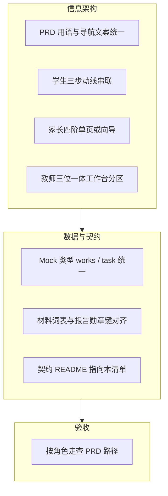

# 系统功能模块与 PRD 对齐分析 · 前端实施清单

> **依据**：[`Product Requirements Document (PRD).md`](./Product%20Requirements%20Document%20(PRD).md) 正文「一～三」+ 仓库现状（`nav-config`、`console-nav`、`(dashboard)` 路由）。  
> **阶段**：前端 UI + Mock；对齐目标为 **交互与信息架构** 与 PRD 一致，**契约字段** 便于后续接 API。

---

## 1. PRD 三条主线 → 系统能力映射

| PRD 方案 | 要解决的用户问题 | 应在产品中呈现的「能力束」 | 当前主要承载（路由/模块） |
|----------|------------------|----------------------------|---------------------------|
| **三步转化法**（想法→方法→做法） | 学生缺方法、缺落地 | 创意输入、AI/材料/步骤辅助、安全与过程提示、短视频作品、社区分享、螺旋激励 | 门户 `/experiments`、`/resources`、闯关、足迹；`experiments/[id]`；运营 AI 策略；社区动态/话题（部分） |
| **三位一体法**（学习—使用—建设） | 教师缺专业支持 | 区本/标杆资源（学）、备课与 AI 辅助（用）、实验管理与评审上架（建） | `/resources`、`/console/resources/*`、教师工作台、`/experiment-manage`、`/teacher/experiment-editor`、`/console/review/*` |
| **四阶联动法**（精准适配—科学指导—同步记录—社交分享） | 家长不会教 | 适龄推荐、指导资源、亲子记录与报告、转发/拍同款/点赞 | **`/parent/lab`（家庭实验室）**、亲子报告模板页；**`/parent/tasks`（任务中心）**；社区侧能力分散 |

---

## 2. 当前模块划分的合理性评估

### 2.1 合理之处（建议保持）

| 设计 | 与 PRD 的关系 |
|------|----------------|
| **门户 / 管理台双壳** | 对应「课堂节点 / 家庭学习入口」与「教师、教研、运营」分工；学生/家长默认门户符合 PRD 家庭与社交场景。 |
| **运营中心 vs 平台管理（Console 分面）** | 把「做实验、聊实验、数据」与「目录、账号、通知审计」拆开，符合「实验社交平台 + 区域治理」双重心智。 |
| **实验三件套**（目录 / 台账 / 探究方案编辑器） | 与 PRD「资源学习—教学使用—建设沉淀」可一一对应；已避免侧栏概念混淆。 |
| **角色导航矩阵** | 教研/校管 RBAC 互斥等与 PRD「专业权 vs 账号权」一致。 |
| **契约与 Mock 分层** | 为后端预留字段名与流水线，符合「当前阶段范围」声明。 |

### 2.2 需优化之处（影响 PRD 叙事完整度）

| 问题 | 说明 | 优化方向 |
|------|------|----------|
| **学生「三步」未聚成一条动线** | PRD 强调从想法到做法的连续体验；当前实验库、闯关、足迹相对并列 | 用 **统一「作品/任务」Mock 类型** + 页面间 **一致 CTA 文案**（见 §3）串联 |
| **「宝山 100」级「学」未突出** | PRD 明确标杆视频包；现有资源分散在工坊/目录 | 在 **`/resources` 或教师工作台** 增加 **「区本示范 / 跟做」** 区块（Mock 列表即可） |
| **家长四阶未串成闭环** | PRD 四阶是顺序体验；当前进度页与报告模板分离 | **单线原型**：家长端分区或分步（推荐→指导→记录→分享）或 **一页四区** |
| **PRD 用语与产品文案** | 「实验库」「实验工坊」等对非研发用户需与 PRD「资源、社交」一致 | 统一 **对外文案表**（与 `RESOURCE_CENTER_NAV_ID` 策略一致） |
| **AI 支点在学生端不可见** | PRD 强调 AI 全程参与；策略多在 Console | 学生流程中增加 **轻量「引导气泡」Mock**（读同一 `localStorage` 人格键或假数据） |

---

## 3. 优化路径（仅前端阶段）

1. **先 IA 与文案**：不改路由大结构，统一术语与侧栏/首屏故事。  
2. **再动线**：学生、家长各一条「可点完」的 Mock 路径。  
3. **最后类型**：`frontend/src/types` 或 `data` 中收敛实体名，与 `docs/contracts` 对齐。

---

## 4. 前端功能对齐清单（可勾选）

> 状态：`[ ]` 未做 `[~]` 部分 `[x]` 已对齐 PRD 交互叙事

### 4.1 PRD「三步转化法」（学生侧）

| # | 对齐项 | 建议落点 | 状态 |
|---|--------|----------|------|
| S1 | 创意输入入口（可 Mock 文本框 +「生成方案」按钮） | `/experiments` 或实验详情扩展 | [ ] |
| S2 | 「想法—方法—做法」分步 UI 与 AI 策略 **可感知一致** | 闯关或实验详情侧栏；引用与 `console/ai` 同人格叙事 | [ ] |
| S3 | 家庭材料与步骤：与 `experimental-materials` 标签 **同词表展示** | 实验详情 / 材料页交叉引用文案 | [ ] |
| S4 | 作品短视频：上传占位 + `work_id` 展示 | 足迹或新「我的作品」列表（Mock） | [ ] |
| S5 | 社区分享：从作品到动态/话题 **一键跳转** | 按钮链到 `/console/social/dynamics` 或门户实验圈 | [ ] |
| S6 | 螺旋激励：他人作品激发「我也试试」 | 动态页或闯关页 **推荐卡**（Mock） | [ ] |

### 4.2 PRD「三位一体法」（教师侧）

| # | 对齐项 | 建议落点 | 状态 |
|---|--------|----------|------|
| T1 | **学习**：区本/示范包首屏入口（对标宝山 100 叙事） | `/teacher/home` 或 `/resources` 首屏区块 | [ ] |
| T2 | **使用**：作业与实验方案绑定展示 | `/teacher/assignments` 与 `experiment-manage` 交叉文案 | [ ] |
| T3 | **建设**：评审状态、同款热度、话题数 **同一列表** | 已有 `experiment-manage` 列；编辑器保存回写 Mock | [~] |
| T4 | 课标/目录与编辑器 **可见关联** | `curriculum-standards` 与编辑器侧栏占位 | [ ] |

### 4.3 PRD「四阶联动法」（家长侧）

| # | 对齐项 | 建议落点 | 状态 |
|---|--------|----------|------|
| P1 | **精准适配**：年龄/难度选择器 + 推荐结果 Mock + **引导节奏（动态调优）** | **`/parent/lab`** 顶区 | [~] |
| P2 | **科学指导**：视频/图解入口（链到资源或内嵌占位） | 同上或分 Tab | [ ] |
| P3 | **同步记录**：时间线或会话列表 Mock；**实验素材采集**（非「上传视频」泛称） | **`/parent/lab`** + `/parent/sessions/[id]` | [~] |
| P4 | **报告**：亲子报告预览块（**Props 仅用契约字段** `summary` / `nextRecommendations` 等） | **`/parent/lab`** 成就卡区 | [~] |
| P5 | **社交分享**：分享 / 拍同款 / 点赞 **占位按钮**；邀请 **班级/家庭组**（禁止泛化「邻居挑战」） | 与报告同一屏 | [ ] |
| P6 | 替换「我的任务」占位为真实流程占位 | **`/parent/tasks`（任务中心）** | [x] |

### 4.4 平台与区域（成效价值）

| # | 对齐项 | 建议落点 | 状态 |
|---|--------|----------|------|
| R1 | 全区看板指标与 PRD **参与率/完成率/互动** 文案一致 | `/district/overview`、`/console/analytics/district` | [~] |
| R2 | 运营报告模板含 **耗材勋章** 叙事 | 已部分：`inventory.material_badges` | [~] |
| R3 | 菜单配置与角色 **与 PRD 干系人** 一致说明 | `admin/menu-config` 帮助文案 | [ ] |

### 4.5 工程与契约（支撑对齐）

| # | 对齐项 | 说明 | 状态 |
|---|--------|------|------|
| E1 | `docs/contracts` 中增加 **本清单链接** | 双向引用 | [ ] |
| E2 | Mock 作品/任务 **单一类型** 导出 | `types` + `data` 收敛 | [ ] |
| E3 | 角色切换后 **PRD 路径可走通** | 脚本或内部走查表 | [ ] |

### 4.6 教研员 · 教研课题组（PRD 增补）

| # | 对齐项 | 建议落点 | 状态 |
|---|--------|----------|------|
| M1 | **课题组校验队列**：待审核优先、状态与契约一致 | `/console/review/project-groups`；`docs/contracts/research-project-group-mock.md` | [~] |
| M2 | **教师侧**：创建课题组、维护成员、提交审核（与台账/实验可选关联） | **`/teacher/research-project-groups`** 卡片管理 + 主导航「课题组管理」；API 见契约 §4 | [~] |

---

## 5. Gemini 建议落地（前端 Mock 阶段）

| 建议 | 落地位置 |
|------|----------|
| 作品流水线：拍同款 → 待审 → 通过 → 实验圈 + 亲子报告提示 | `frontend/src/store/works-pipeline-mock-store.ts`；`submission-bar.tsx`（拍同款）；`console/review/experiments`（`StudentWorksPipelineCard`）；`console/social/dynamics`（已上架区） |
| 教师三位一体 Tab | `resources/page.tsx`「学习 / 使用 / 建设」 |
| 家长四阶 + 勋章 + H5 分享样式 | **`parent/lab/page.tsx`**（家庭实验室）；`parent/sessions/[id]` |
| AI 人格 × 年级后缀同源 | `frontend/src/config/ai-config.ts`；`console/ai/strategies` 与 `StudentAiCoachPanel` 共用 `TUTOR_PERSONA_STORAGE_KEY` |

**路径（建议走查）**：切换 **学生** → 打开有 `SubmissionBar` 的实验详情 →「拍同款并提交审核」→ 切换 **教研** →「实验评审」顶部通过学生队列 →「实验圈动态」出现已上架块。

---

## 6. 文档索引

| 文档 | 用途 |
|------|------|
| [PRD](./Product%20Requirements%20Document%20(PRD).md) | 需求真源 |
| [management-sidebar-ia-closed-loop-mock.md](../contracts/management-sidebar-ia-closed-loop-mock.md) | 六域与闭环 |
| [role-stage-capability-matrix-mock.md](../contracts/role-stage-capability-matrix-mock.md) | 角色×环节 |
| [science-community-console-mock-spec.md](../contracts/science-community-console-mock-spec.md) | API/数据点契约 |
| [api-contract.md](../contracts/api-contract.md) | **parent-sessions** / **parent-reports** 等 REST 字段真源（与 §7、§8 对齐） |
| [research-project-group-mock.md](../contracts/research-project-group-mock.md) | 教研课题组实体、教研员校验与 RBAC |

---

## 7. 修订：家长端优化最高准则

以下作为家长端相关迭代（导航、Mock、类型与契约）的 **最高优先级约束**，与 §4.3、§5 并列执行。

**「家长端优化最高准则」**：

1. **拒绝功能孤岛**：所有功能必须收纳在 **「家庭实验室」**（`/parent/lab`）与 **「任务中心」**（`/parent/tasks`）两个阵地；**禁止第三项平级主导航**（会话、报告等子流程侧栏高亮回 **`parent-lab`**）。
2. **契约即真理**：字段命名必须严格对齐 [`api-contract.md`](../contracts/api-contract.md) 里的 **parent-sessions** 和 **parent-reports**，禁止自造临时字段。
3. **社交有度**：以“成就感”驱动分享，以“任务流”驱动参与，以“AI 导师”作为智慧支点。

---

## 8. 家长端：最终决议稿（开发对齐）

> 本节为 **可执行产品决议**，与 §7 原则一致；用于拆解工单、走查与 Mock 验收。对外导航统一：**任务中心** = `/parent/tasks`；**家庭实验室** = **`/parent/lab`**（旧路径 `/parent/child-progress` **301/redirect 至 lab**）。

### 8.1 信息架构（IA）：“一实一虚”双阵地

| 阵地 | 路由 / 形态 | 核心逻辑 |
|------|-------------|----------|
| **实阵地：【家庭实验室】** | **`/parent/lab`**（原 `child-progress` 能力迁入） | 作为家长 **主工作台**，**卡片式布局**承载「四阶联动」。顶区含 **动态调优**（引导节奏档位，localStorage：`ai_guidance_style`）+ **AI 导师人格后缀**（与 `console/ai/strategies`、`ai-config` 同源），对齐 **精准适配**。 |
| **虚阵地：【任务中心】** | **`/parent/tasks`** | **消息哨所**；列表仅「待办 / 已完成」与跳转辅导会话。**身份绑定** 不在此嵌套表单，仅 **空态 CTA 横幅** → **`/profile/family`**。 |

### 8.2 核心功能：社交钩子的「合规化」改造

| 主题 | 决议 | 理由与要点 |
|------|------|------------|
| **成就卡替代排名制** | **取消「全区排名」**，改为 **「科学能力雷达图」** | 符合 PRD「个性化评价」，缓解过度教育焦虑。报告中突出 **「精彩瞬间」** 与 **「AI 点评」**，作为家长朋友圈类场景的社交素材。 |
| **班级 / 家庭组邀请（替代「邻居挑战」）** | 分享带 **邀请链接 / 二维码**，面向 **班级群或已绑定家庭组** | 规避未成年人泛社交合规风险；为「拍同款」提供 **二次流量**，对齐 PRD 螺旋上升。 |
| **会话内「无感记录」= 实验素材采集** | 统一用语：**实验素材采集**（禁止口语化「上传实验视频」作为产品真源词）；**拍照** 内嵌 **parent-sessions** 会话流 | 素材以 **works** 字段形态归档，落实「同步记录」；契约见 [`api-contract.md`](../contracts/api-contract.md) **parent-sessions** / **works**。 |

### 8.3 家长「3+2」角色模型（产品灵魂 · 与四阶对齐）

| 维度 | 能力项 | 业务价值 | 对应四阶 / 路由锚点 |
|------|--------|----------|---------------------|
| **准备** | 材料筹备 | 线下可执行 | 科学指导 |
| **监护** | 安全底线 | 家庭场景最后一道防线 | 科学指导 / 精准适配（安全档位） |
| **协同** | **动态调优**（家长调节 AI **引导节奏**，非给孩子贴标签） | 人机协同个性化 = **首席助教** | **精准适配** → `/parent/lab` 顶区 |
| **资产** | **实验素材采集** → works | 社区 UGC 与「拍同款」燃料 | **同步记录** → `/parent/sessions/[id]` |
| **荣誉** | 科学成就卡、勋章 | **荣誉经纪人**、成就感分享 | **社交分享** → `/parent/lab` 成就卡区 |
| **信任（弱）** | **陪同确认**（可开关，Mock） | 过程性背书，**非法律担保**；与 **sessionId** 在报告链路可追溯关联 | 同步记录 / 治理预留；禁止与「数字背书」强承诺混用 |

### 8.4 三步施工图（带依赖说明）

| 阶段 | 代号 | 任务 | 依赖说明 |
|------|------|------|----------|
| **第一阶段** | **L0.5 + L1**（骨架对齐） | 在 `/profile`（或 `/profile/family`）建立 **「Demo 孩子绑定」Mock 状态**；基于此状态，使 **`/parent/tasks`** 能按 **StudentId** 过滤展示 Mock 作业。 | **L0.5 先于 L1**：无绑定态时任务列表以空态 + CTA 为主，避免假数据与真实筛选语义冲突。 |
| **第二阶段** | **L2**（血脉打通） | **SessionId 强贯穿**：从任务详情启动实验 → 生成 Session → 直至报告生成；**`/parent/sessions/[id]`** 能读取整段过程数据。 | 与 [`api-contract.md`](../contracts/api-contract.md) **parent-sessions**、**parent-reports** 链路一致；Session 为跨页真源。 |
| **第三阶段** | **L3**（社交闭环） | 上线 **「科学成就卡」** 分享组件；打通 **Works** 流水线，使家长侧素材在 **教师端** 与 **社区动态** 中可正确展示。 | 依赖 L2 的稳定 `work_id` / 媒体引用；分享形态遵守 §8.2 合规边界。 |

---

| 日期 | 说明 |
|------|------|
| 2026-04-12 | 初版：模块合理性、优化路径、前端对齐清单。 |
| 2026-04-12 | 增补：Gemini 流水线 + 三位一体 Tab + 家长四阶 + `ai-config` 同源。 |
| 2026-04-12 | 增补：§4.6 教研课题组；与 PRD、`research-project-group-mock.md`、运营中心导航对齐。 |
| 2026-04-12 | 增补：§7「家长端优化最高准则」（双阵地、契约字段、社交有度）。 |
| 2026-04-12 | 增补：§8「家长端最终决议稿」（IA、合规社交、L0.5–L3 施工图）。 |
| 2026-04-12 | 指令 A–C：§8 增补「3+2」模型与语义（实验素材采集、班级/家庭组邀请、陪同确认）；路由 **`/parent/lab`** + 导航 `parent-lab`；代码：`parent-ai-guidance-style`、`ParentReportPreviewCard`、`parent/lab`。 |
